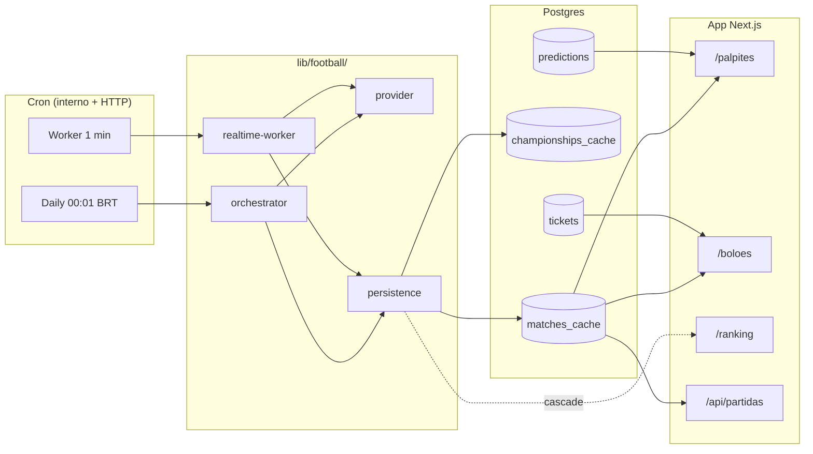
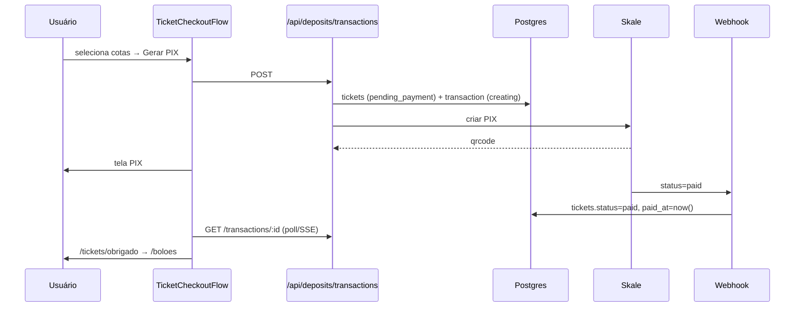

# Bolão do Milhão

Aplicação web do **Bolão do Milhão** — bolão de futebol com **palpites**, **cotas (tickets)**, **ranking** e **premiação** em tempo real.

Stack: **Next.js 16 (App Router)** + **React 19** + **TypeScript 5** + **Tailwind v4** + **PostgreSQL 16** (pg).

> Pagamentos: **PIX via Skale**. Partidas: **API Futebol**. Hosts: **vendas** em `bolaodomilhao.com.br` / `www.bolaodomilhao.com.br`, **app** em `app.bolaodomilhao.com.br`.

---

## Índice

1. [Visão geral](#1-visão-geral)
2. [Arquitetura de bolões (v2)](#2-arquitetura-de-bolões-v2)
3. [Stack e pastas](#3-stack-e-pastas)
4. [Setup local](#4-setup-local)
5. [Banco de dados e migrations](#5-banco-de-dados-e-migrations)
6. [Modalidades de bolão](#6-modalidades-de-bolão)
7. [Fluxo de coleta de partidas](#7-fluxo-de-coleta-de-partidas)
8. [Pontuação, ranking e premiação](#8-pontuação-ranking-e-premiação)
9. [Compra de cotas (tickets / PIX)](#9-compra-de-cotas-tickets--pix)
10. [APIs](#10-apis)
11. [Cron — interno e HTTP](#11-cron--interno-e-http)
12. [Variáveis de ambiente](#12-variáveis-de-ambiente)
13. [Hosts e domínios](#13-hosts-e-domínios)
14. [Deploy](#14-deploy)
15. [O que mudou nesta refatoração](#15-o-que-mudou-nesta-refatoração)

---

## 1. Visão geral

O usuário compra **cotas** (tickets) via PIX, faz **palpites** (placares) para as partidas do bolão e disputa o **ranking** acumulado. Quando o bolão fecha, o pool de prêmios é distribuído automaticamente.

Modalidades:

| Modalidade | Escopo | Endpoint da API |
|------------|--------|------------------|
| **Bolão Geral** | competição inteira (ex.: Copa do Mundo) | `GET /campeonatos/:id/partidas` (hierárquico) |
| **Bolão Diário** | jogos do dia da competição principal | mesmo cache do geral |
| **Ticket Extra — Rodada N** | uma rodada específica de outro campeonato | `GET /campeonatos/:id/rodadas/:rodada` |

> **Importante:** este projeto passou por uma **refatoração total da camada de coleta de partidas** em 2026-05-19. O fluxo antigo (`lib/cron/*`, `lib/ensure-matches-cache-competition`, `runMaintenanceTick`, `needsForcedResultSync`, `syncMatchesCache`, …) **foi removido**. Tudo hoje vive em **`lib/football/`**. Veja [§15](#15-o-que-mudou-nesta-refatoração) para o que mudou e [§2](#2-arquitetura-de-bolões-v2) para a nova arquitetura.

---

## 2. Arquitetura de bolões (v2)

### 2.1 Princípios

- **Cache e banco primeiro.** Toda leitura passa pelo Postgres (`matches_cache`) + cache em memória (`MatchMap`, TTL 3 min). A API externa só é consultada quando o cron diário roda ou quando o worker realtime detecta partidas ativas.
- **Worker em tempo real, mas barato.** Roda a cada 1 minuto e consulta **apenas** as partidas dentro da janela de jogo (e nunca uma já finalizada).
- **Idempotência total.** Daily sync por data BRT, persist por chunks transacional, fechamento de prêmios protegido por `closure_key`.
- **Cascata automática.** Toda escrita de partida → invalida `MatchMap` em memória → revalida tag `leaderboard` → processa fechamentos de prêmios.

### 2.2 Camadas (`lib/football/`)

```
lib/football/
├── provider.ts             ← HTTP API Futebol (3 endpoints)
├── persistence.ts          ← Upsert atômico em matches_cache + championships_cache + cascata
├── sync-orchestrator.ts    ← syncPrincipal / syncExtra / syncAllConfigured / syncAllConfiguredIfStale
├── realtime-worker.ts      ← Tick de 1 min (só partidas ativas, exclui finalizadas)
├── scheduler-v2.ts         ← Scheduler interno (Node/PM2): warmup + daily 00:01 BRT + worker
└── extras-rodada.ts        ← Helpers do Ticket Extra por Rodada
```

### 2.3 Endpoints da API Futebol (apenas estes três)

| Endpoint | Onde | Quando |
|----------|------|--------|
| `GET /campeonatos/:id` | `fetchChampionshipSnapshot` | Daily + ao carregar bolão extra |
| `GET /campeonatos/:id/partidas` | `fetchPrincipalMatches` (modo principal) | Daily |
| `GET /campeonatos/:id/rodadas/:rodada` | `fetchRodadaMatches` (modo extra) | Daily |
| `GET /partidas/:id` | `fetchMatchDetailById` (worker) | 1 vez/min por partida ativa |
| `GET /campeonatos/:id/tabela` | `downloadStandingsJson` | `GET /api/tabela` (sob demanda + cache) |

### 2.4 Fluxo end-to-end



---

## 3. Stack e pastas

| Camada | Tecnologia |
|--------|------------|
| Frontend / SSR | Next.js 16 App Router, React 19 |
| Estilos | Tailwind v4 + `tw-animate-css` + `class-variance-authority` |
| Auth | JWT + cookie httpOnly (`jose`), Google OAuth, OTP SMS |
| DB | PostgreSQL (driver `pg`) |
| Validação | `zod` |
| Pagamento | Skale (PIX) |
| Futebol | API Futebol (api-futebol.com.br) |

Estrutura principal:

```
app/
├── (authenticated)/    ← rotas logadas: /boloes, /palpites, /tickets, /ranking, …
├── api/                ← route handlers
│   ├── auth/           ← login, cadastro, OAuth, OTP
│   ├── cron/           ← realtime-tick, daily-full-sync
│   ├── deposits/       ← criação de PIX + SSE/status
│   ├── palpites/       ← envio, histórico, resumo, ranking
│   ├── partidas/       ← calendário a partir do matches_cache
│   ├── ranking/        ← leaderboard global
│   ├── tabela/         ← classificação (cache + auto-heal API)
│   └── webhooks/       ← skale (PIX)
├── components/         ← componentes compartilhados de tela
└── shared/             ← contextos, Header, NavBottom

lib/
├── auth/               ← sessão, OTP, identificadores
├── football/           ← NOVO: provider + persistence + orchestrator + worker + scheduler
├── payments/           ← Skale, transações, tickets
├── predictions.ts      ← calcPredictionPoints + lockBeforeKickoff
├── prizes/             ← processor + distribution
├── ranking/            ← leaderboard
├── matches-cache.ts    ← LEITURA-only do matches_cache
├── football-api.ts     ← LEITURA-only: fetchMatchesMap
└── …

docs/
├── TICKETS.md          ← documentação completa de tickets/palpites/resultados
└── SEO.md              ← hosts / SEO

scripts/sql/
├── 20260516-tickets-promo-bonus.sql
├── 20260516-registration-sms-codes.sql
├── 20260517-performance-indexes.sql
└── 20260519-arquitetura-bolao-v2.sql    ← migration obrigatória da v2
```

---

## 4. Setup local

```bash
git clone <repo>
cd bolao-do-milhao

cp .env.example .env   # ou copie o .env do servidor
# edite DATABASE_*, AUTH_SECRET, FOOTBALL_API_TOKEN, SKALE_API_KEY

npm install

# 1) aplica as migrations (a do bolão v2 é obrigatória, ver §5)
psql "$DATABASE_URL" -f scripts/sql/20260519-arquitetura-bolao-v2.sql
psql "$DATABASE_URL" -f scripts/sql/20260520-prediction-scores-live.sql
psql "$DATABASE_URL" -f scripts/sql/20260521-tickets-settled-at.sql
psql "$DATABASE_URL" -f scripts/sql/20260521-tickets-extra-gift-unique.sql

# 2) dev server
npm run dev
```

Scripts:

| Comando | O que faz |
|---------|-----------|
| `npm run dev` | Next dev |
| `npm run build` | Next build (gera `.next/`) |
| `npm run start` | Next start |
| `npm run lint` | ESLint |
| `npm run db:test` | Curl em `/api/db/test` |
| `npm run db:indexes` | Aplica `20260517-performance-indexes.sql` |

---

## 5. Banco de dados e migrations

Migrations vivem em `scripts/sql/` e são aplicadas com `psql`. Todas são **idempotentes** (`CREATE … IF NOT EXISTS`, `ADD COLUMN IF NOT EXISTS`, etc.).

| Arquivo | O que faz |
|---------|-----------|
| `20260516-tickets-promo-bonus.sql` | Coluna `is_promo_bonus` em `tickets` |
| `20260516-registration-sms-codes.sql` | Tabela `registration_sms_codes` (OTP) |
| `20260517-performance-indexes.sql` | Índices para palpites/tickets/ranking |
| **`20260519-arquitetura-bolao-v2.sql`** | **Obrigatória**: expande `matches_cache`, cria `championships_cache`, adiciona `tickets.round_number`, cria `sync_run_log` |

### Tabelas-chave

| Tabela | Para que |
|--------|----------|
| `users` | conta, e-mail, CPF, telefone |
| `sessions` (cookie JWT) | autenticação |
| `tickets` | cotas compradas (`general` / `daily` / `extra`) + `round_number` |
| `transactions` | pedido PIX Skale |
| `predictions` | placar palpitado por (usuário, ticket, partida) |
| **`matches_cache`** | partidas (ver §2 — colunas estendidas pela v2) |
| **`championships_cache`** | snapshot por competição (nome, slug, temporada, `rodada_atual`, status) |
| `competitions_cache` | (legado) metadados extra |
| `football_api_cache` | cache de classificação (`standings:{id}`) |
| `prize_*` | fechamentos + prêmios distribuídos |
| `sync_run_log` | auditoria de syncs (v2) |

---

## 6. Modalidades de bolão

| Tipo | DB (`ticket_type`) | Bolão (`bolao_type`) | Origem das partidas |
|------|---------------------|----------------------|---------------------|
| Geral | `general` | `principal` | `FOOTBALL_COMPETITION_ID` (Copa) |
| Diário | `daily` | `diario` | mesma competição, filtrada por dia BR |
| Extra (rodada) | `extra` + `round_number` | `extra` | `BOLOES_EXTRA_CHAMPIONSHIP_IDS` (ex.: Brasileirão) |

**Preços** (`lib/payments/ticket-config.ts`):

```
TICKET_PRICE_GENERAL_CENTS=3990
TICKET_PRICE_DAILY_CENTS=2000
TICKET_PRICE_EXTRA_BOLAO_CENTS=1000
```

Desconto progressivo (mesma compra): 2 cotas −5%, 3 cotas −10%, 4+ cotas −15%.

**Brinde extra pós-login** (`EXTRA_GIFT_PROMO_ENABLED=true`): assim que o usuário entra, um modal oferece **1 cota grátis do bolão extra (Brasileirão) da rodada atual**. O resgate via `POST /api/promotions/extra-gift` é idempotente em três camadas — UI bloqueia o botão durante o POST, app faz SELECT pré-INSERT, e o banco garante via índice único parcial `tickets_extra_gift_unique` (`(user_id, extra_championship_id, round_number) WHERE ticket_type='extra' AND is_promo_bonus=true AND status IN ('paid','approved')`, migration `scripts/sql/20260521-tickets-extra-gift-unique.sql`). Cria um `tickets.is_promo_bonus=true` (não soma ao PIX, não entra no ranking principal nem na distribuição de prêmios) e renova a cada nova rodada do campeonato extra.

**Lock de palpite antes do apito:** geral/diário 60 min, extra 5 min (`lib/palpites-kickoff-lock.ts`).

---

## 7. Fluxo de coleta de partidas

### 7.1 Daily Full Sync (00:01–00:30 BRT)

Roda 1 vez por dia BRT (idempotente por data). Para cada campeonato configurado:

1. `fetchChampionshipSnapshot(id)` → `GET /campeonatos/:id` → grava em `championships_cache`.
2. **Modo principal** (`FOOTBALL_COMPETITION_ID`):
   - `fetchPrincipalMatches(id, meta)` → `GET /campeonatos/:id/partidas` (hierárquico — percorre fases > chaves > ida/volta > partidas).
3. **Modo extra** (cada `BOLOES_EXTRA_*`):
   - lê `rodada_atual` do snapshot.
   - `fetchRodadaMatches(id, rodada, meta)` → `GET /campeonatos/:id/rodadas/:rodada`.
4. `persistMatchesV2(matches)` → upsert em `matches_cache` + cascata (ranking + prêmios).

### 7.2 Realtime Worker (1 min)

Roda a cada 60 s. Cada tick:

1. Query no `matches_cache`:
   - Exclui `finalizado`, `encerrado`, `cancelado`, `adiado`, `suspenso`, `interrompido` (regra absoluta).
   - Inclui jogos com status `ao vivo` / `intervalo` / `pausado` / `em curso` **ou** apito iminente (`now-5min ≤ kickoff ≤ now+5min`) **ou** dentro da janela de jogo (`now ≤ kickoff + 180min`).
   - Limite por tick: `REALTIME_WORKER_MAX_PER_TICK` (default 20).
2. Para cada partida selecionada:
   - `fetchMatchDetailById(matchId)` → `GET /partidas/:id` (1 chamada).
3. `persistMatchesV2(updates)` → upsert + cascata.

> **Regra absoluta:** uma partida com status `finalizado` ou `encerrado` **nunca mais** é consultada na API. Ela vive só no banco/cache.

### 7.3 Startup (warmup)

`startSchedulerV2()` em `instrumentation.ts`:

1. `syncAllConfiguredIfStale()` — se `matches_cache` está vazio para algum campeonato, faz sync agora.
2. Inicia o `setInterval` do worker.

### 7.4 Cascata pós-update

Toda chamada `persistMatchesV2` → `runCascadeAfterMatchUpdate`:

1. **MatchMap em memória** invalidado (`invalidateMatchMapMemoryAfterDbWrite`).
2. **Ranking** revalidado (`revalidateTag('leaderboard')`).
3. **Prêmios** processados (`processPrizeClosuresAfterMatchSync`) — fechamentos idempotentes.

Bilhetes (`predictions`) referem `match_id`; não há cópia de placar/pontuação por palpite, então qualquer tela recalcula automaticamente via `calcPredictionPoints` quando o `MatchMap` cai.

---

## 8. Pontuação, ranking e premiação

### 8.1 Pontuação (`lib/predictions.ts::calcPredictionPoints`)

| Acerto | Pontos |
|--------|--------|
| **Placar exato** | **6** |
| Resultado correto + gols de um dos times | **4** |
| Resultado correto (V/E/D) sem gols exatos | **3** |
| Só gols de um time (sem resultado correto) | **1 por time** |
| Errou tudo | **0** |

Pontos são calculados pela função `calcPredictionPoints(palpite, real)` — **mesma função** usada na pontuação ao vivo e no fechamento (sem divergência possível).

### 8.1.1 Pontuação ao vivo (`prediction_scores`)

A partir da v2.1, mantemos uma **tabela materializada por palpite** com a pontuação atual:

| Coluna | Significado |
|--------|-------------|
| `prediction_id` (PK → `predictions.id`) | 1:1 com o palpite |
| `points / exact / outcome_hit / goals_hit_count` | Resultado de `calcPredictionPoints` no momento do último placar conhecido |
| `last_match_status / last_result_casa / last_result_visitante` | Snapshot da partida no recompute |

**Quando atualiza**: `persistMatchesV2` faz **diff antes do UPSERT**; só recomputa os palpites das partidas com `scoredChanged` (status / placar / pênaltis mudou). Roda **na mesma transação** do UPSERT de `matches_cache`.

**Reversão de pontos**: se um placar muda (1×1 → 2×1) e o palpite passa a valer menos, o UPSERT sobrescreve com o valor novo — a `SUM` por ticket cai automaticamente. Validado por `npm run test:live`.

**Múltiplos jogos no mesmo ticket** / **múltiplos tickets do mesmo usuário**: cobertos pelo `GROUP BY ticket_id` (índice `idx_prediction_scores_ticket`).

**Idempotência**: re-persistir uma partida sem mudança real é **no-op completo** — zero `UPDATE` em `matches_cache`, zero `UPSERT` em `prediction_scores`, zero invalidação de cache no Next.js, zero processamento de prêmios.

**APIs de leitura** (em `lib/predictions/scores-aggregate.ts`):
- `getTicketLiveTotals(ticketId)` — totais agregados de um ticket.
- `getTicketsLiveTotalsBatch(ticketIds[])` — batch.
- `getLiveRankingTopByBolao('principal' | 'diario' | 'extra')` — top N do bolão.

**Backfill** (1× no deploy):
```bash
psql "$DATABASE_URL" -f scripts/sql/20260520-prediction-scores-live.sql
npm run backfill:prediction-scores
```

### 8.2 Ranking (`lib/ranking/leaderboard.ts`)

Unidade de competição = **cota** (`ticket_id`). Tie-break:

1. maior `totalPoints`
2. maior `exactCount`
3. maior `outcomeCount`
4. maior `goalsCount`
5. maior `bestStreak`
6. menor `firstSubmitAt`

Cache: tag `leaderboard` (revalidada pela cascata).

### 8.3 Premiação (`lib/prizes/`)

- **Pool** = 60 % da receita das cotas pagas (`PRIZE_POOL_BPS = 6000`).
- **Faixas** em `distribution.ts`:
  - geral: 1–2506 com pesos decrescentes
  - diário: top 10 pesos fixos
- **Fechamento idempotente** em `processor.ts`:
  - diário: todas as partidas do dia BR resolvidas + `PRIZE_DAILY_GRACE_AFTER_LAST_KICKOFF_MINUTES` (default 180)
  - geral: nada mais futuro + `PRIZE_GENERAL_GRACE_HOURS_AFTER_LAST_KICKOFF` (default 36 h)
  - extra: por campeonato + dia BR (futuro: por rodada)

---

## 9. Compra de cotas (tickets / PIX)

Fluxo resumido (detalhes em [`docs/TICKETS.md`](docs/TICKETS.md)):



Após confirmação:

- comissão de afiliado (`recordReferralCommissionIfApplicable`)
- webhook opcional `PAYMENT_APPROVED_WEBHOOK_URL`
- promo Copa: gera cotas extras grátis em `BOLOES_EXTRA_CHAMPIONSHIP_IDS`

---

## 10. APIs

### 10.1 Auth & cadastro

| Método | Rota | Descrição |
|--------|------|-----------|
| POST | `/api/auth/login` | Login e-mail/CPF + senha |
| POST | `/api/auth/logout` | Encerra sessão |
| POST | `/api/auth/register` | Cria conta (após código WhatsApp) |
| POST | `/api/auth/register/send-code` | Envia código de cadastro (SellFlux) |
| POST | `/api/auth/forgot-password/send-code` | Envia código por e-mail (Resend) |
| POST | `/api/auth/forgot-password/verify-code` | Valida código de recuperação |
| POST | `/api/auth/forgot-password/reset` | Nova senha |
| POST | `/api/auth/cpf-lookup` | Valida CPF no cadastro |
| GET | `/api/auth/google` | Inicia OAuth Google |
| GET | `/api/auth/google/callback` | Callback OAuth |
| GET | `/api/auth/me` | Usuário da sessão |

Páginas: `/login`, `/cadastrar`, `/recuperar-senha`. E-mail transacional: ver [docs/EMAIL.md](docs/EMAIL.md).

### 10.2 Tickets / pagamento

| Método | Rota |
|--------|------|
| GET | `/api/deposits/transactions` |
| POST | `/api/deposits/transactions` |
| GET | `/api/deposits/transactions/:id` |
| GET | `/api/deposits/transactions/:id/events` (SSE) |
| GET | `/api/tickets/mine` |
| GET | `/api/tickets/bolao-type?ticketId=…` |
| POST | `/api/webhooks/skale` |

### 10.3 Palpites & resultados

| Método | Rota |
|--------|------|
| GET / POST | `/api/palpites` |
| GET | `/api/palpites/resumo` |
| GET | `/api/palpites/historico` |
| GET | `/api/palpites/ranking` |
| GET | `/api/ranking/board?mode=principal\|diario\|extra` |
| GET | `/api/partidas?competitionId=&allSynced=` |
| GET | `/api/tabela?competitionId=` |

### 10.4 Cron HTTP (v2)

| Método | Rota |
|--------|------|
| GET | `/api/cron/realtime-tick` |
| GET | `/api/cron/daily-full-sync` |
| GET | `/api/cron/daily-full-sync?force=1` |

Autorização: header `Authorization: Bearer $CRON_SECRET` **ou** `?secret=$CRON_SECRET` **ou** header da Vercel `x-vercel-cron: 1`.

---

## 11. Cron — interno e HTTP

### 11.1 Interno (PM2 / VM)

`instrumentation.ts` chama `startSchedulerV2()` no boot do processo Node. O scheduler:

1. **Warmup**: `syncAllConfiguredIfStale()` se cache vazio.
2. `setInterval(runOnce, REALTIME_WORKER_INTERVAL_SECONDS * 1000)`.
3. Cada tick: `maybeRunDailyFullSync()` (idempotente) + `runRealtimeTick()`.

Por padrão fica **desligado em Vercel** (`process.env.VERCEL` definido). Para forçar: `INTERNAL_CRON_RUN_ON_VERCEL=true`.

### 11.2 HTTP (Vercel / cron externo)

Configure 2 cron jobs:

```jsonc
// vercel.json
{
  "crons": [
    { "path": "/api/cron/realtime-tick",    "schedule": "* * * * *"  },
    { "path": "/api/cron/daily-full-sync",  "schedule": "5 3 * * *"  }  // 03:05 UTC = 00:05 BRT
  ]
}
```

Ou via curl:

```bash
curl -H "Authorization: Bearer $CRON_SECRET" https://app.bolaodomilhao.com.br/api/cron/realtime-tick
curl -H "Authorization: Bearer $CRON_SECRET" https://app.bolaodomilhao.com.br/api/cron/daily-full-sync
curl -H "Authorization: Bearer $CRON_SECRET" 'https://app.bolaodomilhao.com.br/api/cron/daily-full-sync?force=1'
```

---

## 12. Variáveis de ambiente

### 12.1 PostgreSQL

| Env | Default | Descrição |
|-----|---------|-----------|
| `DATABASE_HOST` | — | Host (prioriza sobre `DATABASE_URL` quando definido) |
| `DATABASE_PORT` | `5432` | |
| `DATABASE_USER` | — | |
| `DATABASE_PASSWORD` | — | |
| `DATABASE_NAME` | — | |
| `DATABASE_SSL` | `false` | `true` exige SSL |
| `DATABASE_URL` | — | Alternativa quando a senha não tem caracteres especiais |

### 12.2 App / sessão

| Env | Default | Descrição |
|-----|---------|-----------|
| `AUTH_SECRET` | — | Segredo JWT (mín. 32 chars; prod: `openssl rand -base64 48`) |
| `APP_URL` | — | URL pública do app (`https://app.bolaodomilhao.com.br`) |

### 12.3 E-mail (Resend) e WhatsApp (cadastro)

| Env | Descrição |
|-----|-----------|
| `RESEND_API_KEY` | API key Resend — boas-vindas + recuperar senha |
| `EMAIL_FROM` | Remetente com aspas: `"Nome <noreply@mail.dominio.com.br>"` — subdomínio verificado no Resend |
| `EMAIL_REPLY_TO` | Reply-to opcional |
| `REGISTRATION_WHATSAPP_WEBHOOK_URL` | Webhook SellFlux — **código de confirmação do cadastro** |
| `REGISTRATION_WHATSAPP_WEBHOOK_SECRET` | Bearer opcional no webhook |
| `SMS_APP_NAME` | Nome no texto WhatsApp (default: Bolão do Milhão) |

Checklist: `npm run check:email-env` · Migration senha: `npm run db:password-reset` · Detalhes: [docs/EMAIL.md](docs/EMAIL.md).

### 12.4 Google OAuth

| Env | Descrição |
|-----|-----------|
| `GOOGLE_CLIENT_ID` | Client ID — redirect: `{APP_URL}/api/auth/google/callback` |
| `GOOGLE_CLIENT_SECRET` | Client secret |

### 12.5 Tickets / preços

| Env | Default | Descrição |
|-----|---------|-----------|
| `TICKET_PRICE_GENERAL_CENTS` | `3990` | Preço cota geral |
| `TICKET_PRICE_DAILY_CENTS` | `2000` | Preço cota diário |
| `TICKET_PRICE_EXTRA_CENTS` | `3990` | Preço cota extra (legado) |
| `TICKET_PRICE_EXTRA_BOLAO_CENTS` | `1000` | Preço unitário extra novo |
| `EXTRA_GIFT_PROMO_ENABLED` | `true` | Brinde "1 cota extra grátis por rodada" (modal pós-login) |
| `EXTRA_GIFT_PROMO_CHAMPIONSHIP_ID` | — | ID do campeonato extra concedido (default: 1º Brasileirão de `BOLOES_EXTRA_CHAMPIONSHIP_IDS`) |
| `EXTRA_GIFT_PRIZE_LABEL` | `R$ 10 MIL` | Rótulo do prêmio exibido no card "Valendo …" |
| `EXTRA_GIFT_PROMO_BONUS_LABEL` | _nome do campeonato_ | Nome curto exibido no título do modal |
| `TICKETS_EXTRA_ONLY` | `false` | Quando `true`, só vende extras |
| `TICKETS_HIDE_DAILY` | `false` | Quando `true`, oculta bolão do dia |

### 12.6 PIX / Skale

| Env | Descrição |
|-----|-----------|
| `SKALE_API_URL` | `https://api.skalepayments.com.br` |
| `SKALE_API_KEY` | Chave de API Skale Payments (header `X-API-Key`) |
| `SKALE_WEBHOOK_SECRET` | Secret do webhook no painel Skale (header `webhook-secret` / `x-webhook-secret`) |
| `SKALE_PIX_EXPIRES_IN_DAYS` | Vencimento do QR PIX (padrão `1`) |

Ver `docs/PAYMENTS.md`.
| `PAYMENT_APPROVED_WEBHOOK_URL` | POST opcional após pagamento aprovado |
| `PAYMENT_APPROVED_WEBHOOK_SECRET` | HMAC opcional do webhook acima |
| `PAYMENT_APPROVED_WEBHOOK_TIMEOUT_MS` | timeout (default 12 000) |

### 12.7 API Futebol (v2)

| Env | Default | Descrição |
|-----|---------|-----------|
| `FOOTBALL_API_TOKEN` | — | Token da API Futebol |
| `FOOTBALL_COMPETITION_ID` | `72` | ID do campeonato principal (Copa) |
| `BOLOES_EXTRA_CHAMPIONSHIP_IDS` | — | Lista CSV de campeonatos extras (ex.: `10,15`) |
| `DEBUG_FOOTBALL_API` | `false` | Loga cada GET na API (path + status + ms) |

### 12.8 Scheduler / cron

| Env | Default | Descrição |
|-----|---------|-----------|
| `INTERNAL_CRON_ENABLED` | `true` fora de Vercel | Liga o scheduler interno |
| `INTERNAL_CRON_RUN_ON_VERCEL` | `false` | Permite scheduler interno em Vercel |
| `CRON_SECRET` | — | Token dos `GET /api/cron/*` |

### 12.9 Realtime worker (v2)

| Env | Default | Descrição |
|-----|---------|-----------|
| `REALTIME_WORKER_INTERVAL_SECONDS` | `60` | Intervalo entre ticks |
| `REALTIME_WORKER_WINDOW_MINUTES` | `180` | Janela após apito em que o jogo permanece elegível |
| `REALTIME_WORKER_PRE_KICKOFF_MINUTES` | `5` | Margem antes do apito para começar a consultar |
| `REALTIME_WORKER_MAX_PER_TICK` | `20` | Cap de chamadas `/partidas/:id` por tick |
| `FOOTBALL_ADVISORY_LOCKS_DISABLED` | — | Se `true`, desliga locks Postgres que evitam sync/worker duplicado entre processos (só diagnóstico) |
| `MATCH_MAP_MEMORY_TTL_MS` | `180000` | TTL do `MatchMap` em memória |
| `MATCH_END_CLOCK_AFTER_KICKOFF_MINUTES` | `115` | Minutos após apito em que `/boloes` considera o jogo "deveria ter acabado" (apenas debug) |

### 12.10 Prêmios

| Env | Default | Descrição |
|-----|---------|-----------|
| `PRIZE_DAILY_GRACE_AFTER_LAST_KICKOFF_MINUTES` | `180` | Grace antes de fechar bolão diário |
| `PRIZE_GENERAL_GRACE_HOURS_AFTER_LAST_KICKOFF` | `36` | Grace antes de fechar bolão geral |

### 12.11 Indicações / afiliados

| Env | Default |
|-----|---------|
| `REFERRAL_REWARD_BRONZE_CENTS` | `800` |
| `REFERRAL_REWARD_SILVER_CENTS` | `1000` |
| `REFERRAL_REWARD_GOLD_CENTS` | `1200` |
| `REFERRAL_REWARD_DIAMOND_CENTS` | `1500` |
| `REFERRAL_TIER_SILVER_MIN_COMMISSIONS` | `10` |
| `REFERRAL_TIER_GOLD_MIN_COMMISSIONS` | `25` |
| `REFERRAL_TIER_DIAMOND_MIN_COMMISSIONS` | `50` |
| `AFFILIATE_MIN_WITHDRAWAL_CENTS` | `2000` |

### 12.12 Hosts / domínio

| Env | Descrição |
|-----|-----------|
| `SUBDOMAIN_ROUTING_ENABLED` | Liga o middleware de hosts |
| `SITE_DOMAIN` / `NEXT_PUBLIC_SITE_DOMAIN` | `bolaodomilhao.com.br` |
| `MARKETING_URL` / `NEXT_PUBLIC_MARKETING_URL` | `https://www.bolaodomilhao.com.br` |
| `NEXT_PUBLIC_APP_URL` | `https://app.bolaodomilhao.com.br` |
| `LOCAL_DEV_AS_APP` / `NEXT_PUBLIC_LOCAL_DEV_AS_APP` | Trata `localhost` como app no dev |

### 12.13 Integrações

| Env | Descrição |
|-----|-----------|
| `CPF_BRASIL_API_KEY` | Validação de CPF (brasilapi-like) |

### 12.14 Deploy

| Env | Descrição |
|-----|-----------|
| `DEPLOY_APP_ROOT` | Pasta do app no servidor (script `npm run deploy:github`) |
| `GITHUB_DEPLOY_BRANCH` | Branch a fazer pull |

---

## 13. Hosts e domínios

| Host | Função |
|------|--------|
| `bolaodomilhao.com.br` | Vendas (landing page, /tickets, /cadastrar, etc.) |
| `www.bolaodomilhao.com.br` | Mesmo do apex |
| `app.bolaodomilhao.com.br` | App logada (boloes, palpites, ranking, perfil…) |

Middleware (`lib/site-hosts.ts`): redireciona não autenticado de `app.*/` para `/cadastrar`; visitas ao app por usuário logado seguem direto. CTAs do site marketing usam `NEXT_PUBLIC_APP_URL` para mandar o usuário para o app.

---

## 14. Deploy

### Self-hosted (VM + PM2)

```bash
# 1) servidor
cd $DEPLOY_APP_ROOT
git pull origin main
npm install --omit=dev
psql "$DATABASE_URL" -f scripts/sql/20260519-arquitetura-bolao-v2.sql
psql "$DATABASE_URL" -f scripts/sql/20260520-prediction-scores-live.sql
psql "$DATABASE_URL" -f scripts/sql/20260521-tickets-settled-at.sql
psql "$DATABASE_URL" -f scripts/sql/20260521-tickets-extra-gift-unique.sql
npm run db:password-reset
npm run check:email-env
npm run build
pm2 reload ecosystem.config.js   # ou pm2 restart bolao
```

O scheduler interno do v2 ativa automaticamente no boot do processo Node.

### Vercel

1. Importe o repo.
2. Configure todas as envs (§12).
3. Adicione `vercel.json` com os crons (§11.2).
4. `INTERNAL_CRON_ENABLED=false` ou `INTERNAL_CRON_RUN_ON_VERCEL=true` (não recomendado — serverless).
5. Aplique a migration `20260519-arquitetura-bolao-v2.sql` no banco antes do primeiro deploy.

---

## 15. O que mudou nesta refatoração

### 15.1 Removido

Arquivos do fluxo antigo deletados:

- `lib/cron/bootstrap.ts`
- `lib/cron/maintenance-tick.ts`
- `lib/cron/match-result-guarantee.ts`
- `lib/cron/cron-tick-log.ts`
- `lib/cron/tasks/conditionalMatchesSyncTask.ts`
- `lib/cron/tasks/footballSnapshotsTask.ts`
- `lib/cron/tasks/guaranteeResultsTask.ts`
- `lib/cron/tasks/syncMatchesTask.ts`
- `app/api/cron/tick/route.ts`
- `app/api/cron/garantia-resultados/route.ts`
- `app/api/cron/sync-partidas/route.ts`
- `app/api/cron/football-snapshots/route.ts`
- `app/InternalCronBootstrap.tsx`
- `lib/ensure-matches-cache-competition.ts`
- `lib/football-standings-refresh.ts`

Funções e fluxos removidos:

- `runMaintenanceTick`, `runConditionalMatchesApiSync`, `runGuaranteeResultsTask`, `runSyncMatchesTask`, `runFootballSnapshotsFromApi`, `maybeRunFootballDailySnapshot`, `needsForcedResultSync`, `needsStaleMatchCacheForApiSync`, `getMatchApiRefreshBreakdown`
- `syncMatchesCache`, `requestMatchesCacheSoftSync`, `matchCacheRowsTerminalWithoutScores`, `scheduleSaysFresh`, `matchesCacheIsFresh`, `upsertMatchesCache` (matches-cache)
- `fetchProviderMatches`, `fetchProviderMatchesForAllSyncedCompetitions`, `mergeProviderMatchesWithRoundsAndDetail`, `collectProviderMatches`, `ProviderMatch`, snapshot loaders (football-api)
- `downloadFasesEnrichmentMatches`
- `refreshStandingsFromApiOnce`
- `<InternalCronBootstrap />` no `app/layout.tsx`
- `cronTickLog` (substituído por `prizesLog` simples em `lib/prizes/processor.ts`)

Envs removidas do `.env`:

```
MATCH_LIVE_STUCK_FORCE_MINUTES
MATCH_REFRESH_DEBUG
MATCHES_CACHE_TTL_SECONDS
MATCHES_CACHE_IDLE_SYNC_SECONDS
MATCHES_CACHE_ACTIVE_SYNC_SECONDS
MATCHES_CACHE_PRE_KICKOFF_WINDOW_MINUTES
MATCH_CRON_STALE_REFRESH_MINUTES
MATCH_RESULT_GUARANTEE_HOURS_AFTER_KICKOFF
INTERNAL_CRON_TICK_SECONDS
SCHEDULER_V2_ENABLED       (não precisa mais — sempre v2)
DEBUG_MATCHES_SYNC
```

### 15.2 Adicionado

| Item | Arquivo |
|------|---------|
| Provider único API Futebol | `lib/football/provider.ts` |
| Persistência v2 (campos completos + cascata) | `lib/football/persistence.ts` |
| Orquestrador (principal / extra / all / ifStale) | `lib/football/sync-orchestrator.ts` |
| Worker realtime 1 min | `lib/football/realtime-worker.ts` |
| Scheduler interno | `lib/football/scheduler-v2.ts` |
| Helpers Ticket Extra por Rodada | `lib/football/extras-rodada.ts` |
| Endpoint `GET /api/cron/realtime-tick` | `app/api/cron/realtime-tick/route.ts` |
| Endpoint `GET /api/cron/daily-full-sync` | `app/api/cron/daily-full-sync/route.ts` |
| Migration v2 | `scripts/sql/20260519-arquitetura-bolao-v2.sql` |

Schema novo:

- `matches_cache` ganha: `slug`, `disputa_penalti`, `penaltis_casa`, `penaltis_visitante`, `data_realizacao_iso`, `rodada`, `rodada_slug`, `fase_nome`, `fase_slug`, `championship_name`, `championship_slug`, `championship_temporada`, `home_team_id`, `away_team_id`, `estadio_id`, `estadio_nome`, `provider_payload`.
- Índices `idx_matches_cache_active_window` (worker) e `idx_matches_cache_competition_round` (extras).
- Tabela `championships_cache` (`competition_id` PK + `rodada_atual_*`, `fase_atual_*`).
- `tickets.round_number` (Ticket Extra por Rodada).
- Tabela `sync_run_log` (auditoria).

Envs adicionadas:

```
REALTIME_WORKER_INTERVAL_SECONDS=60
REALTIME_WORKER_WINDOW_MINUTES=180
REALTIME_WORKER_PRE_KICKOFF_MINUTES=5
REALTIME_WORKER_MAX_PER_TICK=20
```

### 15.3 Pontuação ao vivo (v2.1)

| Item | Arquivo |
|------|---------|
| Tabela `prediction_scores` (cache derivado) | `scripts/sql/20260520-prediction-scores-live.sql` |
| Recompute por partida em batch | `lib/predictions/score-recompute.ts` |
| Agregação por ticket / batch / ranking | `lib/predictions/scores-aggregate.ts` |
| Diff antes do UPSERT + recompute na cascata | `lib/football/persistence.ts` |
| Backfill idempotente | `scripts/backfill-prediction-scores.ts` |
| Teste e2e (reversão, idempotência, batch) | `scripts/test-pontuacao-ao-vivo.ts` |

Scripts npm:

```bash
npm run test:v2       # 42 testes
npm run test:e2e      # 41 testes
npm run test:live     # 20 testes — pontuação ao vivo
npm run backfill:prediction-scores
```

### 15.4 Refatorado

- `lib/matches-cache.ts` — agora **só leitura** (`readMatchesCache`, `getExistingMatchIdsFromCache`, `filterPredictionsToOfficialMatchIds`).
- `lib/football-api.ts` — agora **só leitura** (`fetchMatchesMap`, `fetchMatchesMapDirectFromDb`, `resolveKickoffAtIso`, `MatchMap`, `MatchMapEntry`, `getMatchFromMap`, `matchMapKey`).
- `lib/football-external-downloads.ts` — só exporta `downloadStandingsJson`.
- `instrumentation.ts` — chama direto `startSchedulerV2()`.
- `app/api/partidas/route.ts` e `lib/partidas-cache-payload.ts` — fallback de cache vazio via `syncAllConfiguredIfStale`.

### 15.5 Próximo passo (PR separado)

Modalidade **Ticket Extra por Rodada** já tem schema + helpers prontos (`lib/football/extras-rodada.ts`). Falta integrar no produto:

- `TicketCheckoutFlow` mostrar "Rodada N" e gravar `tickets.round_number`.
- `lib/payments/transactions.ts` aceitar `round_number` em `buildPurchaseTicketLines`.
- `/api/palpites` filtrar pelo `round_number` do ticket extra.
- Ranking extra agrupar por `(extra_championship_id, round_number)`.
- `lib/prizes/processor.ts` fechar bolão extra por rodada (e não por dia/campeonato).

---

## Documentos relacionados

- [`docs/TICKETS.md`](docs/TICKETS.md) — fluxo completo de tickets, palpites, resultados, pontuação e premiação
- [`docs/API-FUTEBOL-E-ROTAS.md`](docs/API-FUTEBOL-E-ROTAS.md) — API Futebol, sync v2, worker, cron HTTP e rotas que leem ou disparam chamadas
- [`docs/SEO.md`](docs/SEO.md) — hosts e SEO
- [`lib/google/README.md`](lib/google/README.md) — Google OAuth
