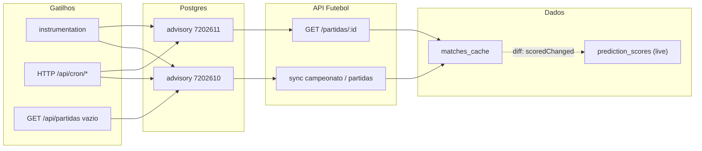
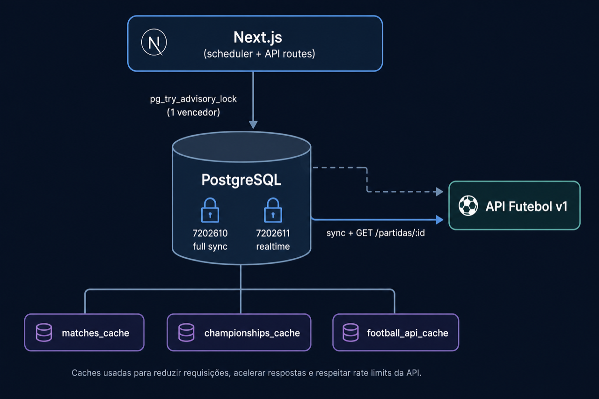

# API Futebol, cache local e rotas da aplicação

Este documento descreve **onde** a API Futebol (`api.api-futebol.com.br/v1`) é chamada, **como** os dados fluem até o Postgres e o site, e **quais rotas HTTP** do Next.js participam de cada cenário.

> Princípio da arquitetura v2: **partidas** vêm da API só nos pontos controlados (sync completo, worker ao vivo, bootstrap se cache vazio). O restante do site **lê `matches_cache` / `football_api_cache` / `championships_cache`** no Postgres (e um cache em memória curto para o `MatchMap`).

**Anti-duplicação (cluster / PM2 / cron + scheduler):** `syncAllConfigured` e `runRealtimeTick` usam **`pg_try_advisory_lock`** no Postgres (`lib/football/advisory-locks.ts`). Só **uma sessão** no banco executa cada tipo de trabalho por vez; os demais processos retornam sem chamar a API Futebol. Desligar (só debug): `FOOTBALL_ADVISORY_LOCKS_DISABLED=true`.

### Resumo por cima

1. **Jogos**: a API é usada para **sincronizar** o acervo (raro) e para **atualizar ao vivo** só partidas na janela ativa; **não** a cada page view.
2. **Site**: palpites, bolões e ranking leem **`matches_cache`** (e mapa em memória com TTL curto).
3. **Várias instâncias Node**: um lock no Postgres garante **no máximo um** full sync e **no máximo um** tick de realtime por vez no cluster compartilhando o mesmo `DATABASE_URL`.

### Resumo técnico

| Camada | Papel |
|--------|--------|
| `lib/football/provider.ts` | Único lugar de HTTP de **partidas** (campeonato, árvore de partidas, rodada, detalhe `/partidas/:id`). |
| `lib/football/sync-orchestrator.ts` | `syncAllConfigured` sob advisory lock **`7202610`**. |
| `lib/football/realtime-worker.ts` | Seleção SQL + `fetchMatchDetailById` sob lock **`7202611`**. |
| `lib/football/persistence.ts` | **SELECT-antes + diff** → UPSERT só se mudou pontuação + `recomputePredictionScoresForMatches` na mesma TX + `runCascadeAfterMatchUpdate`. |
| `lib/predictions/score-recompute.ts` | Recalcula `prediction_scores` (palpite × placar atual) em batch. Suporta reversão de pontos. |
| `lib/predictions/scores-aggregate.ts` | `getTicketLiveTotals`, `getTicketsLiveTotalsBatch`, `getLiveRankingTopByBolao` — leitura barata por `SUM` indexado. |
| `lib/football/scheduler-v2.ts` | Warmup, daily window, `setInterval` do worker. |





---

## 1. Endpoints da API Futebol usados pelo código

| Método | Caminho (v1) | Quem chama | Finalidade |
|--------|--------------|------------|--------------|
| GET | `/campeonatos/{id}` | `lib/football/provider.ts` → `fetchChampionshipSnapshot` | Snapshot do campeonato (rodada atual, fase, nome, slug, temporada). Também usado por `lib/football/extras-rodada.ts` como fallback. |
| GET | `/campeonatos/{id}/partidas` | `lib/football/provider.ts` → `fetchPrincipalMatches` | Lista **hierárquica** (fases → chaves → partidas). Usado só no bolão **principal** (`FOOTBALL_COMPETITION_ID`). |
| GET | `/campeonatos/{id}/rodadas/{n}` | `lib/football/provider.ts` → `fetchRodadaMatches` | Partidas de uma rodada. Usado nos bolões **extra** (`BOLOES_EXTRA_CHAMPIONSHIP_IDS`). |
| GET | `/partidas/{id}` | `lib/football/provider.ts` → `fetchMatchDetailById` | Detalhe de **uma** partida. Usado **apenas** pelo worker em tempo real para jogos na janela ativa. |
| GET | `/campeonatos/{id}/tabela` | `lib/football-external-downloads.ts` → `downloadStandingsJson` | Classificação. **Só** quando o GET `/api/tabela` não encontra cache em `football_api_cache`. **Não** entra no `syncAllConfigured`. |
| GET | `/campeonatos/{id}` (duplicado conceitual) | `lib/competition-metadata-cache.ts` → `fetchCompetitionJsonFromApi` | Só o **nome para exibição** (vitrite/checkout). Grava em `football_api_cache` com chave `competition_meta:{id}`. Usa `fetchFootballApiV1` (não passa pelo `provider.ts` de partidas). |

**Autenticação:** `Authorization: Bearer {FOOTBALL_API_TOKEN}`.

**Logs HTTP:** chamadas que passam por `lib/football-api-fetch.ts` (`fetchFootballApiV1`) respeitam `DEBUG_FOOTBALL_API` / `DEBUG_MATCHES_SYNC`. A função `downloadStandingsJson` usa `fetch` nativo (sem esse log).

---

## 2. Módulos centrais (servidor)

```mermaid
flowchart TB
  subgraph api_ext [API Futebol v1]
    E1["/campeonatos/:id"]
    E2["/campeonatos/:id/partidas"]
    E3["/campeonatos/:id/rodadas/:n"]
    E4["/partidas/:id"]
    E5["/campeonatos/:id/tabela"]
  end

  subgraph lib [lib/]
    P["football/provider.ts"]
    O["football/sync-orchestrator.ts"]
    W["football/realtime-worker.ts"]
    S["football/scheduler-v2.ts"]
    Per["football/persistence.ts"]
    FAF["football-api-fetch.ts"]
    CMD["competition-metadata-cache.ts"]
    FED["football-external-downloads.ts"]
  end

  subgraph db [(PostgreSQL)]
    MC["matches_cache"]
    CC["championships_cache"]
    FAC["football_api_cache"]
    SRL["sync_run_log"]
  end

  E1 --> FAF
  E2 --> FAF
  E3 --> FAF
  E4 --> FAF
  P --> FAF
  E5 --> FED

  O --> P
  O --> Per
  W --> P
  W --> Per
  Per --> MC
  Per --> CC
  CMD --> FAF
  CMD --> FAC
  FED --> FAC

  S --> O
  S --> W
```

- **`sync-orchestrator`**: `syncPrincipal()` (snapshot + partidas hierárquicas), `syncExtra(id)` (snapshot + rodada atual), `syncAllConfigured()`, `syncAllConfiguredIfStale()` (só API se algum `competition_id` configurado tiver **zero** linhas em `matches_cache`, ou se `forceIfOlderThanHours` for usado).
- **`realtime-worker`**: lê `matches_cache` com SQL de “partidas ativas”, depois **N** chamadas `GET /partidas/:id` (até `REALTIME_WORKER_MAX_PER_TICK`, sequenciais).
- **`persistence`**: `persistMatchesV2` faz **diff antes do UPSERT** — busca o estado atual (`status / placar / pênaltis`) em batch, compara com o que veio da API e:
  - se nenhum campo de pontuação mudou ⇒ **0 UPSERTs**, 0 recompute, 0 cascata (modo barato);
  - se mudou ⇒ UPSERT só do que mudou, **recompute** de `prediction_scores` para esses `match_id` na **mesma transação**, depois `runCascadeAfterMatchUpdate` (invalida MatchMap, `revalidateTag('leaderboard')`, `processPrizeClosuresAfterMatchSync`).
- **Pontuação ao vivo (`prediction_scores`)**: cada palpite ganha 0..1 linha derivada `(prediction_id → points, exact, outcome_hit, goals_hit_count)`, atualizada pelo recompute em batch. **Pontos podem diminuir** (se 1×1 vira 2×1, um palpite 1×1 antes valia 6 pts e passa a valer 1). Agregação por ticket: `lib/predictions/scores-aggregate.ts` (`SUM` em índice).

---

## 3. Quando a API é chamada (cenários)

| Cenário | Chamadas à API Futebol | Gatilho |
|---------|------------------------|---------|
| **Boot Node (PM2/VM)** | Possível sync completo **uma vez** se cache vazio; depois ticks periódicos | `instrumentation.ts` → `startSchedulerV2()` → warmup `syncAllConfiguredIfStale()` + `setInterval` com `maybeRunDailyFullSync` + `runRealtimeTick`. |
| **Janela diária 00:01–00:30 BRT** | Full sync: para cada comp principal, `GET /campeonatos/:id` + `/partidas`; para cada extra, `GET /campeonatos/:id` + `/rodadas/:n` (rodada atual + extras configurados no código) | Scheduler interno **ou** GET `/api/cron/daily-full-sync` sem `force` (mesma lógica idempotente por data BRT). |
| **Forçar sync manual** | Igual ao full sync | GET `/api/cron/daily-full-sync?force=1` com `Authorization: Bearer CRON_SECRET` (ou `secret=` / header Vercel Cron). |
| **A cada ~60 s (worker)** | Só `GET /partidas/:id` para até **20** partidas elegíveis | Scheduler interno **ou** GET `/api/cron/realtime-tick`. Partidas **finalizadas / encerradas / canceladas / …** **nunca** entram na query. |
| **Primeiro GET que precisa de partidas e cache vazio** | Full sync (mesma carga que acima) | `GET /api/partidas` ou `getPartidasFasesFromDb()` quando não há linhas no `matches_cache` para a competição → `syncAllConfiguredIfStale()`. |
| **Tela de tabela (classificação)** | `GET /campeonatos/:id/tabela` só se **não** existir JSON em `football_api_cache` (`standings:{id}`) | `GET /api/tabela`. |
| **Nome do campeonato extra (vitrine)** | `GET /campeonatos/:id` só se cache `competition_meta:{id}` ausente ou velho (TTL default 7 dias) | `GET /api/deposits/transactions` (payload da loja) dispara `warmCompetitionMetadataCache` em background; `buildRankingScopes` para tickets extra idem. |

**Vercel / serverless:** com `VERCEL` definido, o scheduler interno **não** roda o intervalo (a menos que `INTERNAL_CRON_RUN_ON_VERCEL=true`). Aí o fluxo de worker + daily depende de **cron HTTP** batendo em `/api/cron/realtime-tick` e `/api/cron/daily-full-sync`.

---

## 4. Rotas `app/api/*` relacionadas a dados de futebol

| Rota | Método | Fonte de dados | Chama API Futebol? |
|------|--------|----------------|--------------------|
| `/api/partidas` | GET | `matches_cache` → JSON em árvore de fases | Só se payload vazio → `syncAllConfiguredIfStale()` |
| `/api/tabela` | GET | `football_api_cache` (`standings:{id}`) | Só em cache miss + token + `competitionId` permitido |
| `/api/cron/realtime-tick` | GET | — | Sim (`runRealtimeTick` → `/partidas/:id`) |
| `/api/cron/daily-full-sync` | GET | — | Sim (`syncAllConfigured` ou `maybeRunDailyFullSync`) |
| `/api/palpites` | GET/POST | `fetchMatchesMapDirectFromDb` (Postgres, sem cache memória) para validar lock/apito | **Não** (só DB) |
| `/api/palpites/ranking` | GET | `fetchMatchesMap` + predictions | **Não** (mapa vem do DB + TTL memória) |
| `/api/palpites/historico` | GET | `fetchMatchesMap` | **Não** |
| `/api/palpites/resumo` | GET | usa `lib/palpites/resumo-compute` → `fetchMatchesMap` | **Não** |
| `/api/deposits/transactions` | GET | preços + nomes extras | Pode (metadata warm em background) |
| `/api/ranking/*` | GET | leaderboard lê predictions + `fetchMatchesMap` | **Não** na maioria; dados de partida já no DB |

Outras rotas (auth, PIX, admin) **não** falam com a API Futebol.

---

## 5. Páginas e layouts (App Router)

| Caminho | Uso de partidas / metadados |
|---------|----------------------------|
| `app/(authenticated)/palpites/page.tsx` | `fetchMatchesMap()` — leitura do Postgres com cache em memória curto. |
| `app/(authenticated)/boloes/page.tsx` | `fetchMatchesMap({ ensureCompetitionIds })` + `warmCompetitionMetadataCache` para rótulos. |
| Vitrine / fluxo de compra | Cliente chama `GET /api/deposits/transactions` → pode aquecer `competition_meta:*` na API. |

Componentes “puros” que só consomem **JSON já montado** pelo servidor ou por `fetch('/api/partidas')` **não** disparam sync sozinhos, exceto quando o handler de `/api/partidas` detecta cache vazio.

---

## 6. Leitura vs escrita: `MatchMap`

- **`fetchMatchesMap`** (`lib/football-api.ts`): lê `matches_cache`, monta `Map`, guarda em memória **~3 min** (`MATCH_MAP_MEMORY_TTL_MS`). Invalidado após `persistMatchesV2` (registro em `lib/match-map-cache-invalidator.ts`).
- **`fetchMatchesMapDirectFromDb`**: mesma fonte, **sem** TTL em memória — usado em `POST /api/palpites` para decisão de lock alinhada ao que está gravado.

---

## 7. Variáveis de ambiente relevantes

| Variável | Papel |
|----------|--------|
| `FOOTBALL_API_TOKEN` | Obrigatório para qualquer chamada à API. |
| `FOOTBALL_COMPETITION_ID` | ID do bolão principal (Copa etc.). |
| `BOLOES_EXTRA_CHAMPIONSHIP_IDS` | Lista de IDs extras (ex. `10`). |
| `INTERNAL_CRON_ENABLED` | Liga scheduler no processo Node (default “ligado” fora da Vercel). |
| `INTERNAL_CRON_RUN_ON_VERCEL` | Permite scheduler na Vercel (geralmente desligado). |
| `CRON_SECRET` | Protege `GET /api/cron/*`. |
| `REALTIME_WORKER_*` | Intervalo, janela, pré-apito, máximo de partidas por tick. |
| `DEBUG_FOOTBALL_API` | Log de requests que passam por `fetchFootballApiV1`. |
| `COMPETITION_META_CACHE_TTL_MS` | TTL do cache de nome do campeonato (default 7 dias). |
| `FOOTBALL_ADVISORY_LOCKS_DISABLED` | Se `true`, desliga `pg_try_advisory_lock` no sync/worker (só diagnóstico local; **não** use em produção com várias instâncias). |

---

## 8. Quando o volume de requisições à API pode subir (riscos)

A arquitetura v2 **evita** reconsultar partidas finalizadas, limita o worker com `REALTIME_WORKER_MAX_PER_TICK` e **serializa** `syncAllConfigured` e `runRealtimeTick` no Postgres (**advisory locks** — ver início deste doc).

### 8.0 Mitigação já implementada (locks)

- **`syncAllConfigured`**: lock `7202610`. Vários processos que tentarem full sync ao mesmo tempo: **só o primeiro** chama a API; os outros recebem `skippedConcurrent: true` e retornam.
- **`runRealtimeTick`**: lock `7202611`. Vários ticks simultâneos (scheduler + cron, ou N réplicas): **só o primeiro** executa os `GET /partidas/:id`; os outros retornam com `skipped: "advisory-lock-busy"`.

**Limite:** locks valem para processos que compartilham o **mesmo** banco PostgreSQL. **Não** deduplica `/api/tabela` nem `competition_meta` (continuam sujeitos a rajada em cache miss).

### 8.1 Vários processos Node (antes do lock, principal risco)

Com **PM2 cluster** ou **várias réplicas** sem lock compartilhado, cada instância repetia o mesmo trabalho. Com o lock, **uma** instância por vez faz o trabalho pesado na API; as outras **não** duplicam chamadas (mas ainda consomem CPU para tentar o lock — custo baixo).

O flag “já rodei o daily hoje” (`__bolaoSchedulerV2DailyDate`) continua **por processo**: em cluster, mais de um nó pode achar que “ainda não rodou hoje” e entrar em `maybeRunDailyFullSync` na janela — **o lock** garante que só um sync de API rode por vez; os outros saem com `skippedConcurrent`.

### 8.2 Scheduler interno + cron HTTP ao mesmo tempo

Ambos chamam `runRealtimeTick`. **O lock** evita dois ticks completos em paralelo no mesmo banco. Ainda é recomendável **não** duplicar agendamento (menos log e menos `pg_try_advisory_lock` inútil): ou scheduler interno, ou cron HTTP.

### 8.3 “Thundering herd” no cache vazio

Muitos `GET /api/partidas` com cache vazio disparam `syncAllConfiguredIfStale` → `syncAllConfigured`. **O lock** serializa: a fila de espera não gera N downloads paralelos da API; cada chamada espera o lock na ordem do pool (na prática, a primeira faz o sync; as demais podem esperar na `try_advisory_lock` — na verdade `pg_try_advisory_lock` **não bloqueia**, retorna false imediatamente).

**Problema residual:** quem recebe `skippedConcurrent` **não** repovoa o cache sozinho — assume que o processo vencedor já gravou. Assim que o primeiro termina, o próximo request que ainda ver cache vazio pode disparar de novo — mas **não** em paralelo com o primeiro. Thundering herd vira **fila de tentativas sequenciais**; ainda pode haver **várias** execuções de sync **em sequência** se cada request chega antes do primeiro persistir (raríssimo se o primeiro sync demora segundos e os clientes re-fetch). Na prática o primeiro sync preenche o cache e os seguintes leem `cache-presente`.

### 8.4 Uso repetido de `?force=1` no daily sync

`GET /api/cron/daily-full-sync?force=1` **sempre** executa `syncAllConfigured()`, ignorando janela e deduplicação por dia. Scripts ou operadores chamando isso com frequência multiplicam o custo da API.

### 8.5 Worker com parâmetros agressivos

- `REALTIME_WORKER_MAX_PER_TICK` muito alto (ex.: 200) + muitos jogos na janela = **centenas** de `GET /partidas/:id` por minuto.
- `REALTIME_WORKER_WINDOW_MINUTES` muito grande mantém jogos “na janela” por horas; se o **status** no banco **não** evolui para finalizado (sync falhou ou API atrasada), o mesmo `match_id` pode ser consultado **todo minuto** até sair da janela ou atualizar status.

### 8.6 Dados inconsistentes no `matches_cache`

Se `status` ou `kickoff_at` estiverem errados (import manual, bug, API antiga), partidas podem entrar na query do worker como “ativas” quando não deveriam — ou o contrário (menos comum para volume). O caso típico de **volume** é: status **nunca** vira finalizado → polling até o fim da janela.

### 8.7 Tabela de classificação (`/api/tabela`)

Cada **cache miss** em `football_api_cache` (`standings:{id}`) dispara **um** `GET /campeonatos/:id/tabela`. Muitos usuários ou crawlers batendo sem cache preenchido = muitas chamadas. Não há lock global entre requests.

### 8.8 Metadados de campeonato (`competition_meta:*`)

`warmCompetitionMetadataCache` chama `GET /campeonatos/:id` para IDs **ausentes ou com TTL expirado** (`COMPETITION_META_CACHE_TTL_MS`). Volume alto só se o cache for apagado constantemente ou TTL muito curto com muitos IDs distintos.

### 8.9 `syncExtra` com muitas rodadas no futuro

Hoje `syncAllConfigured` chama `syncExtra(id)` **sem** `extraRodadas` → só a rodada atual. Se no futuro o código passar `extraRodadas` com muitos números, cada rodada é **+1** `GET /campeonatos/:id/rodadas/:n` por full sync.

---

## 9. Pontuação ao vivo (`prediction_scores`) — v2.1

Antes os pontos dos palpites eram somados **on-read** a cada page view (caro em escala). A partir desta versão, mantemos uma **tabela materializada por palpite** atualizada **só quando o placar muda de verdade**:

- **Tabela**: `prediction_scores (prediction_id PK, ticket_id, user_id, match_id, bolao_type, points, exact, outcome_hit, goals_hit_count, last_match_status, last_result_casa, last_result_visitante, computed_at)`. Migration: `scripts/sql/20260520-prediction-scores-live.sql`.
- **Quem escreve**: `lib/predictions/score-recompute.ts → recomputePredictionScoresForMatches(client, matchIds)`. Chamada pelo `persistMatchesV2` **dentro da mesma transação**, apenas para os `scoredChangedIds` detectados pelo diff. Usa `calcPredictionPoints(palpite, real)` — exatamente a mesma função usada por `processClosure`, então o fechamento e a leitura ao vivo **sempre** concordam.
- **Reversão de pontos**: se um placar muda (1×1 → 2×1) o palpite que era exato (6 pts) pode passar a valer 1 pt (só acertou 1 gol). O `UPSERT` sobrescreve; a `SUM` do ticket cai automaticamente no próximo SELECT.
- **Múltiplos jogos por ticket / múltiplos tickets por usuário**: cobertos pelo `GROUP BY ticket_id` na agregação. `prediction_id` é único, então uma `predictions` linha gera 1 `prediction_scores` linha; o `SUM(points) GROUP BY ticket_id` agrega tudo corretamente.
- **Quem lê**: `lib/predictions/scores-aggregate.ts`
  - `getTicketLiveTotals(ticketId)` — 1 query, índice `(ticket_id)`.
  - `getTicketsLiveTotalsBatch(ticketIds[])` — batch.
  - `getLiveRankingTopByBolao(bolaoType, { limit })` — top N por bolão (`idx_bolao_points`).
- **Idempotência**: re-persistir uma partida sem mudança real é **no-op**: zero UPSERTs em `matches_cache`, zero recompute em `prediction_scores`, zero cascata. Validado pelo `npm run test:live`.
- **Backfill**: `npm run backfill:prediction-scores` (rodar uma vez no deploy; idempotente).
- **Teste**: `npm run test:live` cobre idempotência, reversão, retorno de placar, finalização, agregação batch, ticket inexistente.

### Cascata completa

```
worker tick (ou full sync)
   └── persistMatchesV2(provider matches)
         ├── SELECT estado atual (1 query batch)
         ├── diff por (status / placar / penaltis) → scoredChangedIds
         ├── se nada mudou → return (0 writes, 0 cascade)
         ├── UPSERT matches_cache (só os mudados)
         ├── recomputePredictionScoresForMatches(scoredChangedIds)   [mesma TX]
         ├── COMMIT
         └── runCascadeAfterMatchUpdate
               ├── invalidateMatchMapMemoryAfterDbWrite
               ├── revalidateTag('leaderboard', 'max')
               └── processPrizeClosuresAfterMatchSync
```

---

## 10. Leitura adicional

- [`README.md`](../README.md) — visão geral do projeto e envs.
- [`TICKETS.md`](TICKETS.md) — tickets, palpites, resultados, prêmios e seção da arquitetura v2.

---

*Última revisão do código: alinhado ao repositório em maio/2026 (arquitetura v2).*
