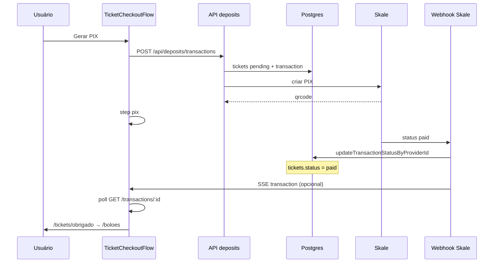
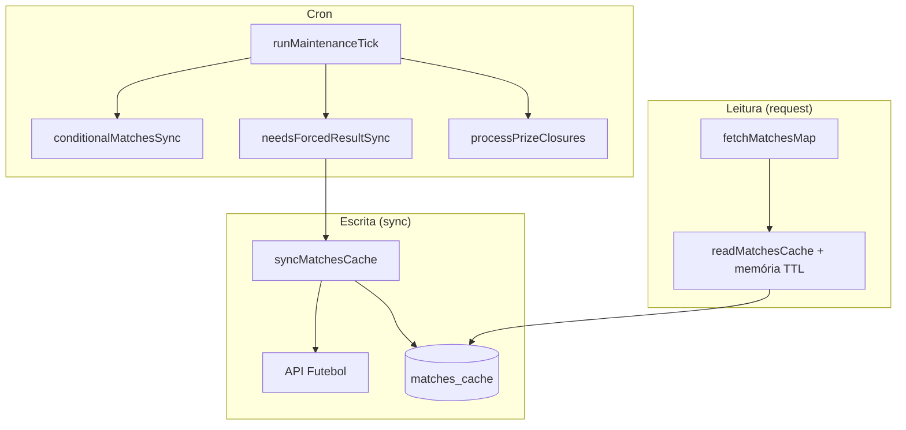
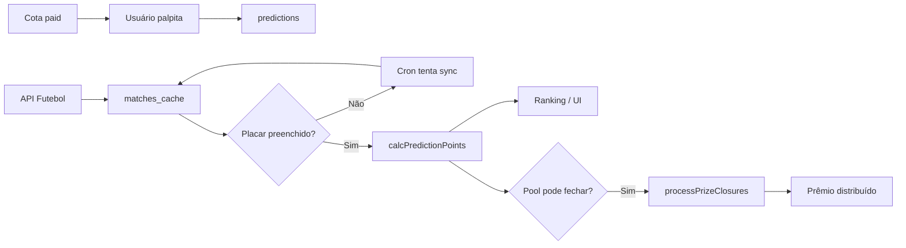
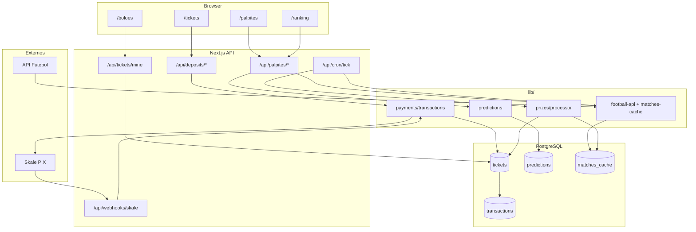
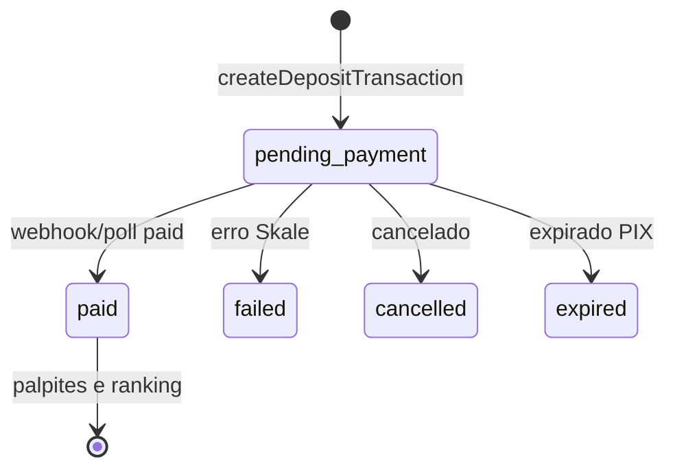
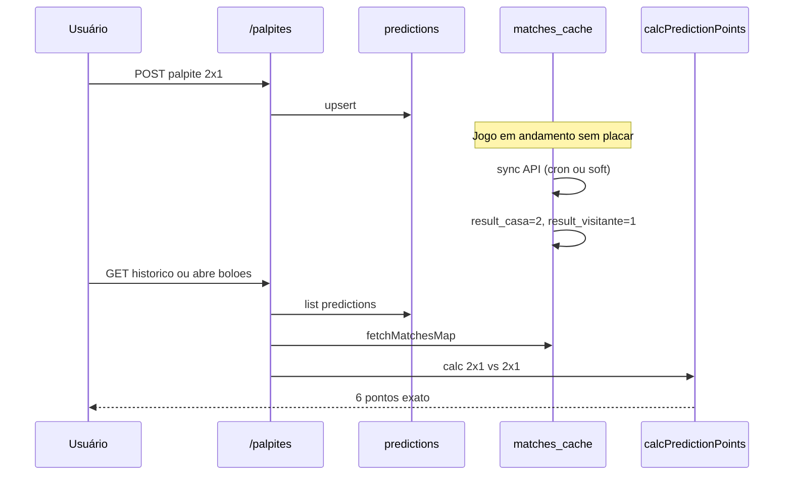

# Tickets, palpites e resultados — documentação técnica

Documentação do fluxo de **compra de cotas (tickets)**, **palpites**, **atualização de resultados**, **pontuação**, **ranking** e **premiação** no Bolão do Milhão.

> Implementação principal: `lib/payments/`, `lib/predictions.ts`, `lib/football/`, `lib/matches-cache.ts`, `lib/prizes/`, `app/(authenticated)/tickets/`.

> **Arquitetura v2 (2026-05-19):** a coleta/atualização de partidas foi reescrita em `lib/football/` (provider, persistência, orquestrador, realtime worker e scheduler). O fluxo antigo (`lib/cron/*`) **foi removido**. Veja a seção §15 e o `README.md` raiz para detalhes. Para **mapa completo de endpoints da API Futebol, rotas Next e quando cada um dispara**, use [`docs/API-FUTEBOL-E-ROTAS.md`](API-FUTEBOL-E-ROTAS.md).

---

## Índice

1. [Conceitos](#1-conceitos)
2. [Modelo de dados](#2-modelo-de-dados)
3. [Tipos de ticket e bolões](#3-tipos-de-ticket-e-bolões)
4. [Compra e pagamento (PIX)](#4-compra-e-pagamento-pix)
5. [Pós-pagamento e telas](#5-pós-pagamento-e-telas)
6. [Palpites](#6-palpites)
7. [Resultados das partidas](#7-resultados-das-partidas)
8. [Pontuação](#8-pontuação)
9. [Ranking e desempate](#9-ranking-e-desempate)
10. [Premiação](#10-premiação)
11. [APIs](#11-apis)
12. [Cron e atualização automática](#12-cron-e-atualização-automática)
13. [Variáveis de ambiente](#13-variáveis-de-ambiente)
14. [Diagramas](#14-diagramas)
15. [Arquitetura v2 (sync de partidas)](#15-arquitetura-v2-sync-de-partidas)

---

## 1. Conceitos

| Termo | Significado no código |
|--------|------------------------|
| **Ticket / cota** | Uma linha na tabela `tickets` = **1 cota comprada** (UUID). Não é “1 pedido”; um pedido PIX pode gerar várias linhas. |
| **Transaction** | Um pedido PIX na Skale (`transactions`), com valor total e QR code. |
| **Palpite** | Placar previsto pelo usuário para uma partida, ligado a um `ticket_id` (`predictions`). |
| **Resultado** | Placar oficial da partida em `matches_cache.result_casa` / `result_visitante` (origem: API Futebol + sync). |
| **Pontuação** | Calculada **em tempo de leitura** com `calcPredictionPoints` — não há coluna “pontos” gravada por palpite. |
| **Ranking** | Ordenação de cotas (por `ticket_id`) agregando palpites + resultados. |
| **Premiação** | Fechamento de bolão + distribuição de pool (cron `lib/prizes/processor.ts`). |

**Fonte de verdade após pagamento:** `tickets.status = 'paid'`.  
**Legado:** `localStorage` (`bolao_owned_tickets_v1`, IDs `TG-` / `TD-` / `TE-`) — otimismo no client; o banco prevalece via `GET /api/tickets/mine`.

---

## 2. Modelo de dados

### 2.1 `tickets`

Cada cota do carrinho vira **uma row**:

| Campo | Descrição |
|-------|-----------|
| `id` | UUID (usado em palpites e ranking) |
| `user_id` | Dono da cota |
| `ticket_type` | `general` \| `daily` \| `extra` |
| `extra_championship_id` | Campeonato do bolão extra (só `extra`) |
| `unit_price_cents` / `total_amount_cents` | Valor pago (0 se promo grátis) |
| `is_promo_bonus` | Cota extra grátis (promo Copa → Brasileirão) |
| `status` | `pending_payment` → `paid` \| `failed` \| `cancelled` \| `expired` |
| `transaction_id` | Transação PIX do pedido |
| `external_ref` | Ex.: `ticket_{uuid}:p0` |
| `paid_at` | Preenchido quando pago |

### 2.2 `transactions`

| Campo | Descrição |
|-------|-----------|
| `id` | UUID interno |
| `ticket_id` | Primeiro ticket do lote (legado/compat) |
| `amount_cents` | Soma das linhas **pagas** (promo não entra) |
| `provider` | `3xpay` |
| `status` | `creating` → status Skale → `paid` / etc. |
| `pix_qrcode` | Copia-e-cola PIX |
| `provider_transaction_id` | ID na Skale |
| `external_ref` | Ex.: `ticket_{uuid}` |
| `raw_request` / `raw_response` / `raw_webhook` | Auditoria |

### 2.3 `predictions`

| Campo | Descrição |
|-------|-----------|
| `user_id`, `ticket_id`, `match_id` | Chave lógica do palpite |
| `bolao_type` | `principal` \| `diario` \| `extra` (espelha o tipo do ticket) |
| `score_casa`, `score_visitante` | Palpite do usuário |
| `submitted_at`, `updated_at` | Timestamps |

**Constraint:** `ON CONFLICT (user_id, ticket_id, match_id)` — um palpite por partida por cota.

### 2.4 `matches_cache`

Cache local das partidas (API Futebol espelhada no Postgres):

| Campo | Uso |
|-------|-----|
| `competition_id` | Copa principal ou campeonato extra |
| `match_id` | ID da partida na API |
| `status` | `agendado`, `andamento`, `encerrado`, etc. |
| `kickoff_at`, `date_br`, `hour_br` | Apito / calendário BR |
| `result_casa`, `result_visitante` | **Placar oficial** (quando sincronizado) |
| `home_*`, `away_*` | Times, escudos |
| `synced_at` | Última sync |

**Sem placar preenchido:** a partida **não entra** no cálculo de pontos (palpite fica “aguardando resultado”).

### 2.5 Tabelas de prêmio (resumo)

Geridas por `lib/prizes/processor.ts` (fechamento idempotente por `closure_key`):

- Pool de receita das cotas pagas → `PRIZE_POOL_BPS` (60% da receita)
- Bandas de premiação (geral vs diário vs extra)
- Registro de fechamento para não pagar duas vezes

---

## 3. Tipos de ticket e bolões

| `ticket_type` (DB) | UI / `bolao_type` (palpites) | Competição | Comportamento |
|--------------------|------------------------------|------------|----------------|
| `general` | `principal` | `FOOTBALL_COMPETITION_ID` (Copa) | Palpites em jogos da competição principal; ranking global do bolão geral |
| `daily` | `diario` | Mesma competição principal | Palpites em **um dia** (`resolveDiarioPlayableDate`); cota “do dia” |
| `extra` | `extra` | `BOLOES_EXTRA_CHAMPIONSHIP_IDS` | Palpites no campeonato extra (ex. Brasileirão); lock 5 min antes do apito |

**Mapeamento de IDs:**

- Prefixo legado: `TG-` → principal, `TD-` → diário (`lib/ticket-kind-shared.ts`)
- UUID: consulta `tickets.ticket_type` (`lib/ticket-kind-server.ts`)

**Flags da loja** (`lib/ticket-shop-flags.ts`):

- `TICKETS_EXTRA_ONLY` — só extras em `/tickets`
- `TICKETS_HIDE_DAILY` — oculta bolão do dia na vitrine

**Preços** (`lib/payments/ticket-config.ts`):

| Env | Default | Tipo |
|-----|---------|------|
| `TICKET_PRICE_GENERAL_CENTS` | 3990 | Geral |
| `TICKET_PRICE_DAILY_CENTS` | 2000 | Diário |
| Preço extra | `getExtraBolaoUnitCents()` | Extra |

**Desconto progressivo** (por tipo, na mesma compra): 2 cotas 5%, 3 → 10%, 4+ → 15%.

**Brinde extra pós-login** (`EXTRA_GIFT_PROMO_ENABLED`): modal automático ao logar oferece **1 cota grátis do bolão extra da rodada atual** (POST `/api/promotions/extra-gift`, idempotente). Cria `tickets.is_promo_bonus=true` — não entra no PIX, não conta para ranking principal nem para distribuição de prêmios. Renova a cada nova rodada.

---

## 4. Compra e pagamento (PIX)

### 4.1 Entrada do usuário

| Rota | Componente |
|------|------------|
| `/tickets` | `TicketCheckoutFlow` |
| `/tickets?bolao=diario` | Foco bolão do dia |
| `/tickets?bolao=extra&championshipId=N` | Foco extra |

CTAs na LP: `TicketPurchaseLink` → cadastro ou `/tickets`.

### 4.2 Fluxo da UI (`TicketCheckoutFlow`)

| Step | Tela |
|------|------|
| `shop` | Seleção de quantidades + total |
| `generating` | Gerando PIX |
| `pix` | QR / copia-e-cola + timer + “Já paguei” |

Catálogo: `GET /api/deposits/transactions` (preços, `extraBoloes`, promo).

### 4.3 Servidor: `createDepositTransaction`

Arquivo: `lib/payments/transactions.ts`

1. Valida usuário (nome, CPF 11 dígitos, telefone).
2. `buildPurchaseTicketLines()` — monta N linhas com desconto e promo.
3. `INSERT` em lote em `tickets` (`pending_payment`).
4. `INSERT` em `transactions` (`creating`).
5. `createThreeXPayCashIn()` — 3xPay (`lib/payments/threexpay.ts`).
6. Atualiza transaction + vincula `tickets.transaction_id`.
7. Falha Skale → `tickets` e `transaction` → `failed`.

### 4.4 Confirmação de pagamento



| Canal | Onde |
|-------|------|
| **Webhook** | `POST /api/webhooks/threexpay` → `updateTransactionStatusByProviderId` |
| **SSE** | `GET /api/deposits/transactions/:id/events` (`publishTransactionEvent`) |
| **Polling** | Client a cada 2s (30s) depois 4s |

Status considerados pagos no client: `paid`, `approved`, `success`, `completed`, `confirmed`.

Após pago (primeira vez):

- Comissão de afiliado (`recordReferralCommissionIfApplicable`)
- Webhook opcional `PAYMENT_APPROVED_WEBHOOK_URL`
- `appendTicketsFromPurchase` no localStorage (legado)

---

## 5. Pós-pagamento e telas

| Etapa | Rota | O que faz |
|-------|------|-----------|
| Obrigado | `/tickets/obrigado` | Resumo; countdown → `/boloes?fromPurchase=1` |
| Vitrine | `/boloes` | `loadBoloesData` — cotas pagas + links `/palpites?ticket=` |
| Palpites | `/palpites?ticket={uuid}` | Enviar/editar placares |
| Ranking | `/ranking` | Leaderboards por modo |
| Histórico | API `/api/palpites/historico` | Palpites com placar e pontos calculados |

**Estado da cota na vitrine** (`listPaidTicketsForUser` em `lib/payments/user-tickets.ts`):

| Campo | Significado |
|-------|-------------|
| `dailyStatus` | `disponivel` \| `em_uso` \| `usado` (diário/extra) |
| `playDate` | Dia BR da rodada |
| `availableGames` | Jogos ainda palpíveis naquele escopo |

---

## 6. Palpites

### 6.1 Envio

`POST /api/palpites` (`app/api/palpites/route.ts`):

- Body: `{ ticketId, matchId, scoreCasa, scoreVisitante }`
- Valida ticket **pago** e pertencente ao usuário
- Infere `bolao_type` (principal / diario / extra)
- Bloqueia se partida encerrada ou após **lock antes do apito**
- `upsertPrediction` no Postgres

### 6.2 Lock antes do apito

`lib/palpites-kickoff-lock.ts`:

| Bolão | Antecedência mínima |
|-------|---------------------|
| Principal / diário | **1 hora** (`PALPITE_LOCK_BEFORE_KICKOFF_MS_DEFAULT`) |
| Extra | **5 minutos** (`PALPITE_LOCK_BEFORE_KICKOFF_MS_EXTRA`) |

### 6.3 Bolão do dia — data jogável

`resolveDiarioPlayableDate` (`lib/diario-playable-date.ts`): define qual **data BR** vale para palpites do diário/extra naquela competição (primeiro dia com jogos em aberto).

### 6.4 Leitura

| Endpoint | Uso |
|----------|-----|
| `GET /api/palpites?ticketId=` | Lista palpites do ticket |
| `GET /api/palpites/resumo` | Totais: palpites, acertos, pontos, exatos (`computePalpitesResumo`) |
| `GET /api/palpites/historico` | Histórico com mandante/visitante, resultado e pontos |

---

## 7. Resultados das partidas

> **A partir da v2** (ver §15) a coleta/atualização foi reescrita em `lib/football/`. Esta seção documenta o **estado atual em produção** (cache + leitura), válido para v1 e v2.

### 7.1 Origem dos dados

1. **API Futebol** (token `FOOTBALL_API_TOKEN`) — partidas, status, placares.
2. **Persistência** em `matches_cache` via `persistMatchesV2` (`lib/football/persistence.ts`) — campos completos + cascata.
3. **Leitura** pela app via `fetchMatchesMap()` (`lib/football-api.ts`) — mapa em memória com TTL (~3 min), invalidado em cascata por toda escrita.

Extração de placar: `lib/partida-placar.ts` (`pickScoreFromPartidaPayload`) — campos como `placar_mandante`, `gols_visitante`, string `placar`, etc.

### 7.2 Quando um jogo “tem resultado” para pontuação

Uma partida conta para pontos quando:

```text
matches_cache.result_casa IS NOT NULL
AND matches_cache.result_visitante IS NOT NULL
```

Status “encerrado” **sem** placar **não** pontua (evita premiação antecipada — ver `isMatchResolvedForPrizes` no processor).

### 7.3 Atualização — camadas



| Mecanismo | Arquivo | Quando roda |
|-----------|---------|-------------|
| Sync condicional | `lib/cron/tasks/conditionalMatchesSyncTask.ts` | Cache defasado ou janela ativa |
| Sync forçado | `lib/cron/match-result-guarantee.ts` | Palpite existe + apito passou + sem placar |
| Pipeline noturno | `footballSnapshotsTask` | Snapshot diário tabela/fases/partidas |
| Soft sync em GET | `fetchMatchesMap` / partidas | Intervalo mínimo entre syncs em background |

**Garantia de placar atrasado** (`needsForcedResultSync`):

- Apito + `MATCH_RESULT_GUARANTEE_HOURS_AFTER_KICKOFF` (default 3h) sem placar, com palpite.
- Apito + `MATCH_END_CLOCK_AFTER_KICKOFF_MINUTES` (default 115 min) — jogo deveria ter acabado.
- Status “ao vivo”/agendado sem placar + `MATCH_LIVE_STUCK_FORCE_MINUTES` (default 95 min).
- Status encerrado/finalizado mas placar ainda nulo.

### 7.4 Partidas na home logada

`LoggedInHome` (`HomePageClient.tsx`): `GET /api/partidas?allSynced=1` — próximos jogos para exibição (não é pontuação; é calendário).

---

## 8. Pontuação

### 8.1 Função canônica

**Arquivo:** `lib/predictions.ts` — `calcPredictionPoints(predCasa, predVisit, realCasa, realVisit)`

| Situação | Pontos | Flags |
|----------|--------|--------|
| **Placar exato** | **6** | `exact: true`, `outcomeHit: true` |
| Acertou vencedor/empate **e** gols de **pelo menos um** time | **4** | `outcomeHit: true`, `goalsHitCount` 1 ou 2 |
| Acertou vencedor/empate, **sem** acertar gols dos times | **3** | `outcomeHit: true`, `goalsHitCount: 0` |
| Não acertou resultado, mas acertou gols de um time | **1** por time | até 2 pts (`goalsHitCount`) |
| Errou tudo | **0** | |

**Vencedor/empate:** comparação de diferença de gols (vitória casa, visitante ou empate).

Isso é o mesmo exibido na LP em `SCORE_RULES` (`HomePageClient.tsx` / `ScoreRulesCards`).

### 8.2 Onde a pontuação é calculada

| Local | Função |
|-------|--------|
| Resumo do ticket | `computePalpitesResumo` |
| Histórico de palpites | `GET /api/palpites/historico` |
| Ranking bolões (SSR) | `buildRankingMap` em `boloes/page.tsx` |
| Ranking API | `GET /api/palpites/ranking`, `GET /api/ranking/board` |
| Leaderboard | `lib/ranking/leaderboard.ts` |
| Premiação | `buildRanking` em `lib/prizes/processor.ts` |
| Admin | `lib/admin/sections.ts` |

**Importante:** pontos **não são gravados** na tabela `predictions`; qualquer tela recalcula quando o placar existe no cache.

### 8.3 Exemplo numérico

| Palpite | Resultado real | Pontos |
|---------|----------------|--------|
| 2×1 | 2×1 | 6 (exato) |
| 2×1 | 3×1 | 4 (vitória casa + 1 gol casa) |
| 1×1 | 0×0 | 3 (empate) |
| 0×0 | 1×0 | 1 (só gols visitante) |
| 3×0 | 0×2 | 0 |

---

## 9. Ranking e desempate

### 9.1 Unidade de ranking

O ranking compete por **cota** (`ticket_id`), não por usuário — um usuário com 3 cotas gerais pode aparecer 3 vezes.

### 9.2 Ordenação (tie-break)

Usada em bolões, ranking global e prêmios (ordem de comparação):

1. **Maior** `totalPoints`
2. Maior `exactCount` (placares exatos)
3. Maior `outcomeCount` (acertos de resultado)
4. Maior `goalsCount` (gols de time acertados)
5. Maior `bestStreak` (sequência de jogos com pontos > 0, em ordem cronológica de apito)
6. **Menor** `firstSubmitAt` (quem palpitou antes)

Implementação repetida em `lib/ranking/leaderboard.ts`, `app/api/palpites/ranking/route.ts`, `lib/prizes/processor.ts`.

### 9.3 Modos de leaderboard

`GET /api/ranking/board?mode=...`:

| mode | Escopo |
|------|--------|
| `principal` | Todas as cotas `general` pagas na competição principal |
| `diario` | Cotas `daily` — requer `ticketId` (ranking daquela cota/dia) |
| `extra` | Cotas `extra` — requer `ticketId` |

Cache: `RANKING_CACHE_SECONDS` (default 12s) via `unstable_cache`.

### 9.4 Posição na vitrine `/boloes`

`loadBoloesData` calcula por ticket: palpites enviados, jogos totais abertos, `progress`, posição no ranking global (`buildRankingMap`).

---

## 10. Premiação

### 10.1 Pool de prêmios

`lib/prizes/distribution.ts`:

- `PRIZE_POOL_BPS = 6000` → **60%** da receita das cotas pagas do bolão fechado.
- `calculatePrizePoolCents(totalRevenueCents)` aplica essa taxa.

### 10.2 Fechamento de bolão

`lib/prizes/processor.ts` — `processPrizeClosuresAfterMatchSync` (idempotente).

**Partida “resolvida” para fechar bolão:**

- Placar oficial preenchido, **ou**
- Status cancelado/adiado/suspenso/interrompido (sem exigir placar).

**Condições extras por tipo:**

| Tipo | Fecha quando |
|------|----------------|
| **Diário** | Todas as partidas **daquele dia BR** resolvidas + margem após último apito (`PRIZE_DAILY_GRACE_AFTER_LAST_KICKOFF_MINUTES`, default 180 min) |
| **Geral** | Nenhum jogo futuro no cache + todas resolvidas + margem após último apito (`PRIZE_GENERAL_GRACE_HOURS_AFTER_LAST_KICKOFF`, default 36h) |
| **Extra** | Por campeonato + data (chave `competitionId:extra:dateBR`) |

### 10.3 Distribuição

- **Geral:** faixas de posição 1–2506+ com pesos (`GENERAL_PRIZE_BANDS`).
- **Diário:** top 10 com pesos fixos (`DAILY_PRIZE_WEIGHTS`).
- **Extra:** regras específicas no processor (por campeonato/data).

Após fechamento: ranking interno → `calculatePrizeAwards` → persistência de prêmios (não detalhado neste doc; ver código do processor).

### 10.4 Relação ticket → prêmio

- Só entram tickets **`paid`** e não promocionais gratuitos na receita (linhas pagas).
- Pontuação do fechamento usa o mesmo `calcPredictionPoints` e desempate do ranking.

---

## 11. APIs

### Compra / PIX

| Método | Rota | Descrição |
|--------|------|-----------|
| GET | `/api/deposits/transactions` | Catálogo (preços, extras, promo) |
| POST | `/api/deposits/transactions` | Criar carrinho + PIX |
| GET | `/api/deposits/transactions/:id` | Status da transação |
| GET | `/api/deposits/transactions/:id/events` | SSE de atualização |
| POST | `/api/webhooks/threexpay` | Webhook 3xPay (PIX pago) |

### Tickets do usuário

| Método | Rota | Descrição |
|--------|------|-----------|
| GET | `/api/tickets/mine` | Cotas pagas enriquecidas |
| GET | `/api/tickets/bolao-type?ticketId=` | Tipo do bolão |

### Palpites e resultados

| Método | Rota | Descrição |
|--------|------|-----------|
| GET/POST | `/api/palpites` | Listar / salvar palpite |
| GET | `/api/palpites/resumo` | Totais de pontos |
| GET | `/api/palpites/historico` | Histórico com resultado e pontos |
| GET | `/api/palpites/ranking` | Ranking por bolão |
| GET | `/api/ranking/board` | Leaderboard principal/diário/extra |

### Partidas (calendário)

| Método | Rota | Descrição |
|--------|------|-----------|
| GET | `/api/partidas` | Jogos do cache (`allSynced=1` inclui extras) |

### Cron

| Método | Rota | Descrição |
|--------|------|-----------|
| GET | `/api/cron/tick` | Tick completo (auth `CRON_SECRET`) |
| GET | `/api/cron/garantia-resultados` | Garantia dedicada (se existir no deploy) |

---

## 12. Cron e atualização automática

### 12.1 Tick principal

`runMaintenanceTick` (`lib/cron/maintenance-tick.ts`):

1. Snapshot noturno futebol (se na janela).
2. Sync condicional com API (se não rodou pipeline noturno).
3. `runGuaranteeResultsTask`:
   - sync forçado se `needsForcedResultSync()`
   - `processPrizeClosuresAfterMatchSync()`

Disparo:

- `instrumentation.ts` — scheduler interno (`INTERNAL_CRON_ENABLED`)
- `GET /api/cron/tick` — HTTP com `CRON_SECRET` ou header Vercel Cron

### 12.2 Após sync de partidas

`syncMatchesCache` ao finalizar sync bem-sucedido chama `processPrizeClosuresAfterMatchSync` — prêmios podem fechar assim que placares chegam.

### 12.3 Fluxo completo: do palpite ao prêmio



---

## 13. Variáveis de ambiente

### Compra / tickets

```env
TICKET_PRICE_GENERAL_CENTS=3990
TICKET_PRICE_DAILY_CENTS=2000
TICKETS_EXTRA_ONLY=false
TICKETS_HIDE_DAILY=false
EXTRA_GIFT_PROMO_ENABLED=true
# EXTRA_GIFT_PROMO_CHAMPIONSHIP_ID=10
# EXTRA_GIFT_PRIZE_LABEL=R$ 10 MIL
# EXTRA_GIFT_PROMO_BONUS_LABEL=Brasileirão
BOLOES_EXTRA_CHAMPIONSHIP_IDS=10,...
```

### PIX / Skale

```env
THREEXPAY_API_URL=https://gateway.3xpay.co
THREEXPAY_API_KEY=...
THREEXPAY_API_SECRET=...
THREEXPAY_CALLBACK_URL=        # default: APP_URL/api/webhooks/threexpay
THREEXPAY_WEBHOOK_SECRET=
APP_URL=https://app.bolaodomilhao.com.br
PAYMENT_APPROVED_WEBHOOK_URL=
```

### API Futebol / cache de partidas

```env
FOOTBALL_API_TOKEN=...
FOOTBALL_COMPETITION_ID=...
MATCHES_CACHE_TTL_SECONDS=120
MATCHES_CACHE_ACTIVE_SYNC_SECONDS=120
MATCH_MAP_MEMORY_TTL_MS=180000
```

### Garantia de resultado

```env
MATCH_RESULT_GUARANTEE_HOURS_AFTER_KICKOFF=3
MATCH_END_CLOCK_AFTER_KICKOFF_MINUTES=115
MATCH_LIVE_STUCK_FORCE_MINUTES=95
```

### Premiação

```env
PRIZE_DAILY_GRACE_AFTER_LAST_KICKOFF_MINUTES=180
PRIZE_GENERAL_GRACE_HOURS_AFTER_LAST_KICKOFF=36
```

### Cron

```env
CRON_SECRET=...
INTERNAL_CRON_ENABLED=true
INTERNAL_CRON_TICK_SECONDS=300
```

### Ranking

```env
RANKING_CACHE_SECONDS=12
```

---

## 14. Diagramas

### 14.1 Arquitetura por camadas



### 14.2 Estados do ticket (pagamento)



### 14.3 Ciclo de vida: resultado → pontos na UI



---

## Arquivos-chave (referência rápida)

| Área | Arquivos |
|------|----------|
| Checkout | `app/(authenticated)/tickets/_components/TicketCheckoutFlow.tsx` |
| Config preços | `lib/payments/ticket-config.ts` |
| PIX / DB | `lib/payments/transactions.ts`, `lib/payments/threexpay.ts` |
| Webhook | `app/api/webhooks/threexpay/route.ts` |
| Cotas pagas | `lib/payments/user-tickets.ts` |
| Palpites | `lib/predictions.ts`, `app/api/palpites/route.ts` |
| Pontuação | `calcPredictionPoints` em `lib/predictions.ts` |
| Partidas | `lib/matches-cache.ts`, `lib/football-api.ts`, `lib/partida-placar.ts` |
| Garantia placar | `lib/cron/match-result-guarantee.ts`, `lib/cron/tasks/guaranteeResultsTask.ts` |
| Ranking | `lib/ranking/leaderboard.ts`, `app/(authenticated)/boloes/page.tsx` |
| Prêmios | `lib/prizes/processor.ts`, `lib/prizes/distribution.ts` |
| localStorage legado | `app/(authenticated)/tickets/lib/ownedTicketsStorage.ts` |

---

## 15. Arquitetura v2 (sync de partidas)

Reescrita da camada de coleta/atualização de partidas. Objetivos:

- Performance: prioriza **cache e banco local**; só vai à API externa quando necessário.
- Tempo real: worker de **1 minuto** consulta **apenas** partidas em janela ativa.
- Custo: **nunca consulta** partidas com status `finalizado` / `encerrado` / `cancelado` / `adiado` / `suspenso`.
- Escalabilidade: persistência atômica + cascata de invalidação (`match_map` em memória, `revalidateTag('leaderboard')`, fechamento de prêmios).
- **Pontuação ao vivo (v2.1)**: tabela materializada `prediction_scores` é recomputada **dentro da mesma transação** do UPSERT em `matches_cache`, **somente** para as partidas cuja pontuação realmente mudou. **Pontos podem cair** se o palpite passa a valer menos (placar foi 1×1 e virou 2×1 → exato 6 pts → 1 pt). Múltiplos jogos no mesmo ticket são agregados via `SUM GROUP BY ticket_id` (`lib/predictions/scores-aggregate.ts`). Veja `scripts/test-pontuacao-ao-vivo.ts` (`npm run test:live`) e `docs/API-FUTEBOL-E-ROTAS.md` § 9.

### 15.1 Modalidades

| Modalidade | Origem | Endpoint da API | Quando atualiza |
|------------|--------|------------------|------------------|
| **Bolão Geral** | `FOOTBALL_COMPETITION_ID` | `GET /campeonatos/:id/partidas` (hierárquico) | Daily 00:01 BRT + worker 1 min |
| **Bolão Diário** | mesma competição principal | (reusa o cache do geral) | mesmas rotinas |
| **Ticket Extra — Rodada N** | cada `BOLOES_EXTRA_*` | `GET /campeonatos/:id` → `rodada_atual` → `GET /campeonatos/:id/rodadas/:rodada` | Daily 00:01 BRT + worker 1 min |

### 15.2 Arquivos

| Camada | Arquivo |
|--------|---------|
| Provider HTTP (API Futebol) | `lib/football/provider.ts` |
| Persistência Postgres | `lib/football/persistence.ts` |
| Orquestrador (principal/extra/all/stale) | `lib/football/sync-orchestrator.ts` |
| Worker realtime (1 min) | `lib/football/realtime-worker.ts` |
| Scheduler interno (PM2/VM) | `lib/football/scheduler-v2.ts` |
| Extras por rodada (helpers) | `lib/football/extras-rodada.ts` |
| Migration | `scripts/sql/20260519-arquitetura-bolao-v2.sql` |

### 15.3 Provider — `lib/football/provider.ts`

| Função | O que faz |
|--------|-----------|
| `fetchChampionshipSnapshot(id)` | `GET /campeonatos/:id` → nome/slug/temporada/`rodada_atual`/`fase_atual`/status |
| `fetchPrincipalMatches(id, meta?)` | `GET /campeonatos/:id/partidas` → percorre **fases > chaves > ida/volta > partidas** recursivamente e retorna lista plana |
| `fetchRodadaMatches(id, rodada, meta?)` | `GET /campeonatos/:id/rodadas/:rodada` → todas as partidas daquela rodada |
| `fetchMatchDetailById(matchId)` | `GET /partidas/:id` — **único endpoint** usado pelo worker |

Tipos canônicos: `ProviderMatchV2` e `ChampionshipSnapshotV2` carregam **todos** os campos pedidos na especificação (partida_id, status, slug, placar, placar_mandante, placar_visitante, disputa_penalti, data_realizacao, hora_realizacao, data_realizacao_iso, time_id, nome, nome_popular, sigla, escudo, estadio_id/nome_popular, campeonato_id/nome/slug/temporada, rodada).

### 15.4 Persistência — `lib/football/persistence.ts`

`persistMatchesV2(matches, opts)`:

- Upsert idempotente em `matches_cache` (transação única, chunks de 60).
- `COALESCE` em campos opcionais para nunca destruir placar/escudo já no banco.
- Persiste payload original em `provider_payload` (jsonb) para auditoria.
- **Após o commit**, dispara `runCascadeAfterMatchUpdate`:
  1. invalida `match_map` em memória (`invalidateMatchMapMemoryAfterDbWrite`)
  2. `processPrizeClosuresAfterMatchSync(source)` — fecha bolões elegíveis
  3. `revalidateTag('leaderboard')` — invalida ranking

`persistChampionshipSnapshot(snapshot)`:

- Upsert em `championships_cache` (nome, slug, temporada, `rodada_atual_*`, `fase_atual_*`, status, raw_payload).

### 15.5 Orquestrador — `lib/football/sync-orchestrator.ts`

| Função | Uso |
|--------|-----|
| `syncPrincipal()` | snapshot + `fetchPrincipalMatches` → persiste tudo |
| `syncExtra(id, { extraRodadas? })` | snapshot → `rodada_atual` → `fetchRodadaMatches` (e rodadas extras opcionais) → persiste |
| `syncAllConfigured()` | principal + cada extra (`BOLOES_EXTRA_CHAMPIONSHIP_IDS`) |
| `syncAllConfiguredIfStale({ forceIfOlderThanHours? })` | startup: se cache vazio, baixa. Se `forceIfOlderThanHours` ativado, baixa caso a última sync seja antiga. |

### 15.6 Daily full sync (00:01 BRT)

`maybeRunDailyFullSync()` em `lib/football/scheduler-v2.ts`:

- Janela: 00:01–00:30 BRT.
- Idempotente por data BRT (`globalThis.__bolaoSchedulerV2DailyDate`).
- Chama `syncAllConfigured()` — atualiza **toda** a base.

### 15.7 Realtime worker (1 min)

`runRealtimeTick()` em `lib/football/realtime-worker.ts`:

```text
Etapa 1  — agora()
Etapa 2  — query matches_cache:
             status NÃO é finalizado/encerrado/cancelado/adiado/suspenso/interrompido
             E (
               status indica ao vivo/intervalo/pausado/em curso
               OU kickoff_at >= now() - 5min  (margem pré-apito)
                  E kickoff_at <= now() + 5min
               OU kickoff_at <= now()
                  E now() <= kickoff_at + 180min  (janela após apito)
             )
             LIMIT REALTIME_WORKER_MAX_PER_TICK  (default 20)
Etapa 3  — para CADA partida selecionada:
             GET /v1/partidas/:id  (única chamada por partida por tick)
Etapa 4  — persistMatchesV2(updates)
             ↓
             cascata: match_map invalidado + ranking revalidado + prêmios processados
```

**Regra absoluta:** `lower(status) LIKE '%finaliz%'` **nunca** entra na query do worker (cláusula de exclusão é a primeira condição WHERE). Esses jogos vivem só no banco/cache.

Configuração:

```env
REALTIME_WORKER_INTERVAL_SECONDS=60
REALTIME_WORKER_WINDOW_MINUTES=180
REALTIME_WORKER_PRE_KICKOFF_MINUTES=5
REALTIME_WORKER_MAX_PER_TICK=20
```

### 15.8 Inicialização

`instrumentation.ts` chama `startSchedulerV2()` (idempotente). O scheduler:

1. **Warmup**: `syncAllConfiguredIfStale()` em background — popula cache se vazio.
2. Inicia `setInterval(runOnce, REALTIME_WORKER_INTERVAL_SECONDS * 1000)`.
3. A cada tick: `maybeRunDailyFullSync()` + `runRealtimeTick()`.

Em **Vercel** o scheduler é desligado (use cron HTTP, abaixo). Para forçar em Vercel: `INTERNAL_CRON_RUN_ON_VERCEL=true`.

### 15.9 Cron HTTP (Vercel / disparo externo)

| Rota | Função | Cadência sugerida |
|------|--------|-------------------|
| `GET /api/cron/realtime-tick` | `runRealtimeTick()` | a cada 1 min |
| `GET /api/cron/daily-full-sync` | `maybeRunDailyFullSync()` (idempotente) | 03:05 UTC = 00:05 BRT |
| `GET /api/cron/daily-full-sync?force=1` | `syncAllConfigured()` | manual / emergência |
| `GET /api/cron/tick` (legacy) | `runMaintenanceTick` antigo | desativado quando v2 está ligado |

Autorização: header `Authorization: Bearer $CRON_SECRET` ou query `?secret=...` ou header da Vercel `x-vercel-cron: 1`.

### 15.10 Schema (migration)

Arquivo: `scripts/sql/20260519-arquitetura-bolao-v2.sql` (idempotente).

**Aplicar antes de subir o scheduler v2:**

```bash
psql "$DATABASE_URL" -f scripts/sql/20260519-arquitetura-bolao-v2.sql
```

Mudanças:

- `matches_cache` ganha: `slug`, `disputa_penalti`, `penaltis_casa`, `penaltis_visitante`, `data_realizacao_iso`, `rodada`, `rodada_slug`, `fase_nome`, `fase_slug`, `championship_name`, `championship_slug`, `championship_temporada`, `home_team_id`, `away_team_id`, `estadio_id`, `estadio_nome`, `provider_payload`.
- Índice parcial `idx_matches_cache_active_window` (worker 1 min).
- Índice `idx_matches_cache_competition_round` (lookup extra por rodada).
- Nova tabela **`championships_cache`** (`competition_id` PK).
- `tickets.round_number` (extra por rodada).
- Tabela `sync_run_log` (auditoria).

### 15.11 Cascata pós-update (bilhetes / ranking)

Toda chamada `persistMatchesV2` dispara `runCascadeAfterMatchUpdate`:

1. **Cache em memória** (`match_map`) invalidado → próximo request lê os novos placares do banco.
2. **Ranking** (Next cache tag `leaderboard`) revalidado → `/ranking` mostra dados frescos.
3. **Prêmios** — `processPrizeClosuresAfterMatchSync` roda o fechamento idempotente: se o último jogo do bolão (geral/diário/extra) acabou, o pool é distribuído.
4. **Bilhetes** — os palpites em `predictions` referem `match_id`. Não há cópia de placar nem de pontos por palpite; basta o `match_map` cair que `GET /api/palpites/historico` recalcula automaticamente via `calcPredictionPoints` (veja §8).

### 15.12 Modalidade "Ticket Extra por Rodada"

A coluna `tickets.round_number` foi adicionada na migration. O conceito muda de:

```
Ticket Extra (campeonato 10)
```

para:

```
Ticket Extra — 17ª Rodada (campeonato 10, rodada 17)
Ticket Extra — 18ª Rodada (campeonato 10, rodada 18)
Ticket Extra — Quartas    (campeonato 10, rodada N)
```

**Helpers prontos** em `lib/football/extras-rodada.ts`:

| Função | Uso |
|--------|-----|
| `resolveCurrentExtraRound(id)` | rodada atual a partir do `championships_cache` (fallback: provider) |
| `listMatchesForExtraRound(id, rodada)` | partidas da rodada direto do `matches_cache` |
| `listExtraRoundsSnapshot(ids)` | snapshot para a loja: `[{ competitionId, championshipNome, rodada, matchCount }]` |

**Pendente para próximo PR** (escopo grande — checkout + ranking + UI):

- `TicketCheckoutFlow` exibir "Rodada N" e gravar `tickets.round_number` na compra.
- `lib/payments/transactions.ts` aceitar `round_number` ao montar `buildPurchaseTicketLines`.
- `/api/palpites` filtrar pelo `round_number` do ticket extra (não só `extra_championship_id`).
- Ranking extra agrupar por `(extra_championship_id, round_number)` — leaderboard separado por rodada.
- `lib/prizes/processor.ts` fechar bolão extra por rodada (e não por dia/campeonato).

A infra de coleta/persistência já está pronta para isso — o orquestrador grava `rodada` por partida e o cache de campeonatos sabe qual a rodada ativa.

### 15.13 Rollback

O fluxo antigo foi removido. Rollback agora é via `git revert` do commit da v2 (ou restaurar os arquivos a partir da tag pré-v2).

---

## Documentos relacionados

- [SEO e hosts](SEO.md) — www vs app
- [README do projeto](../README.md) — setup e scripts
- Google OAuth: [lib/google/README.md](../lib/google/README.md)
